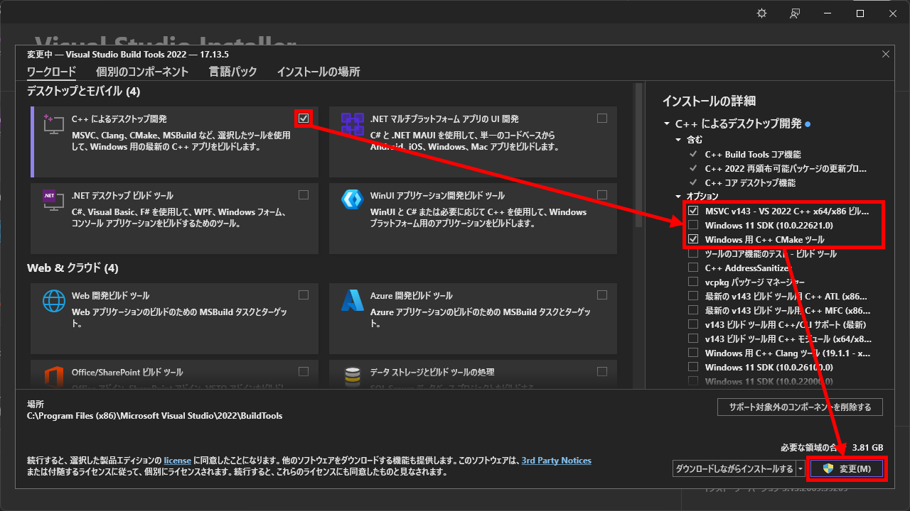
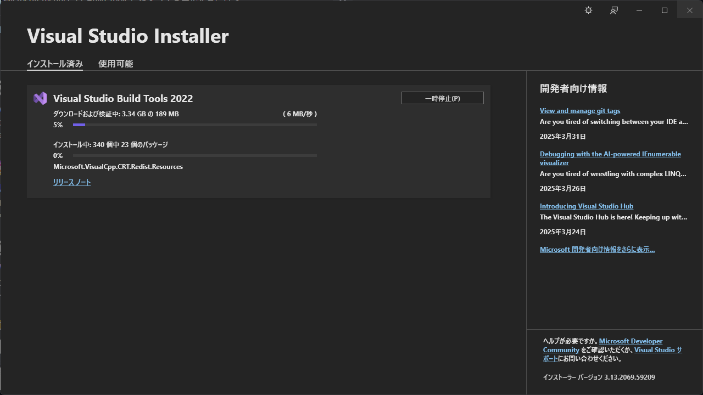
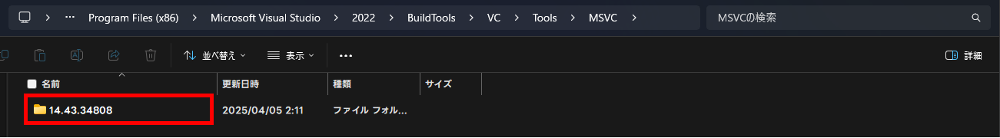
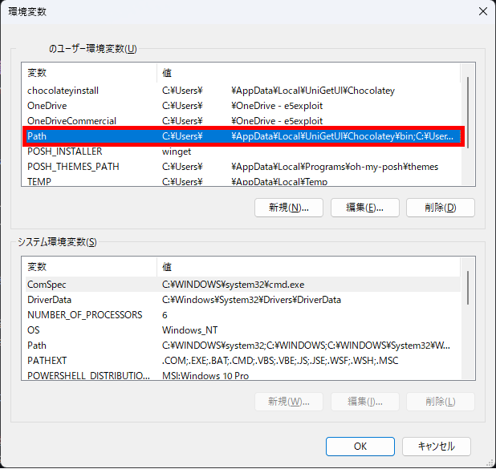
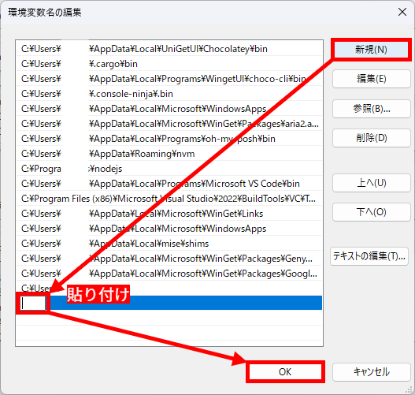
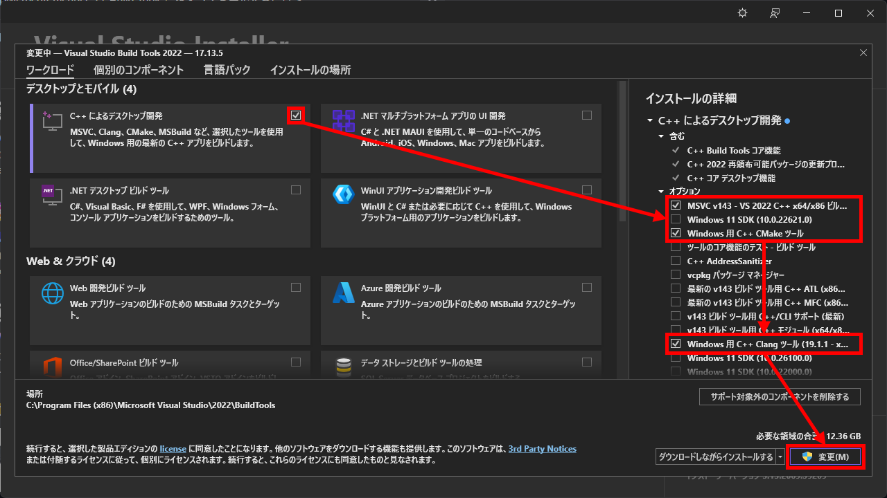
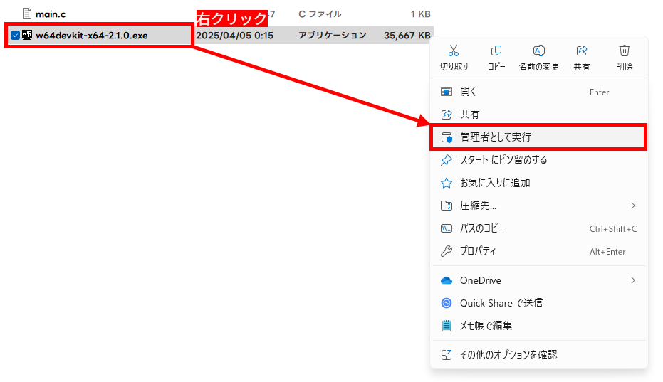
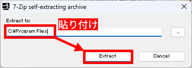
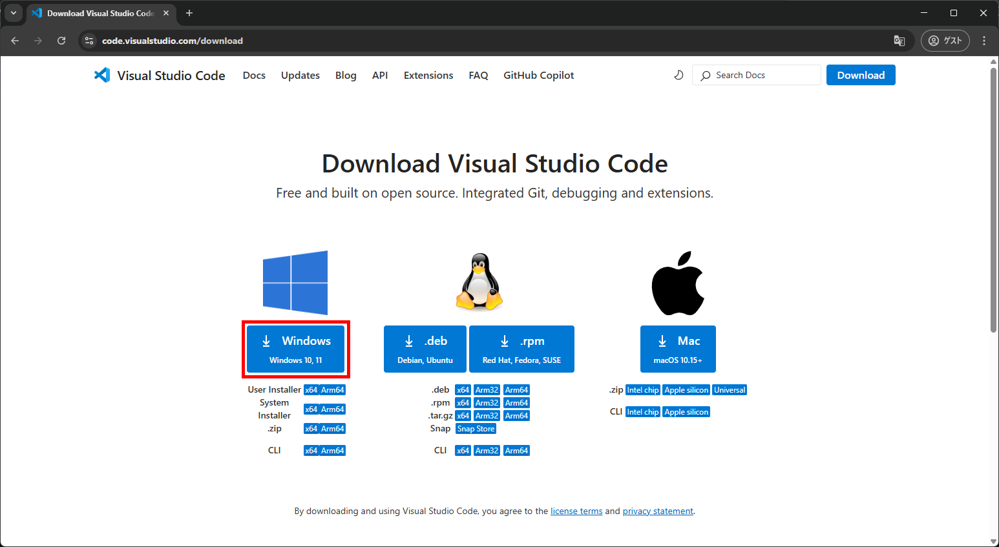
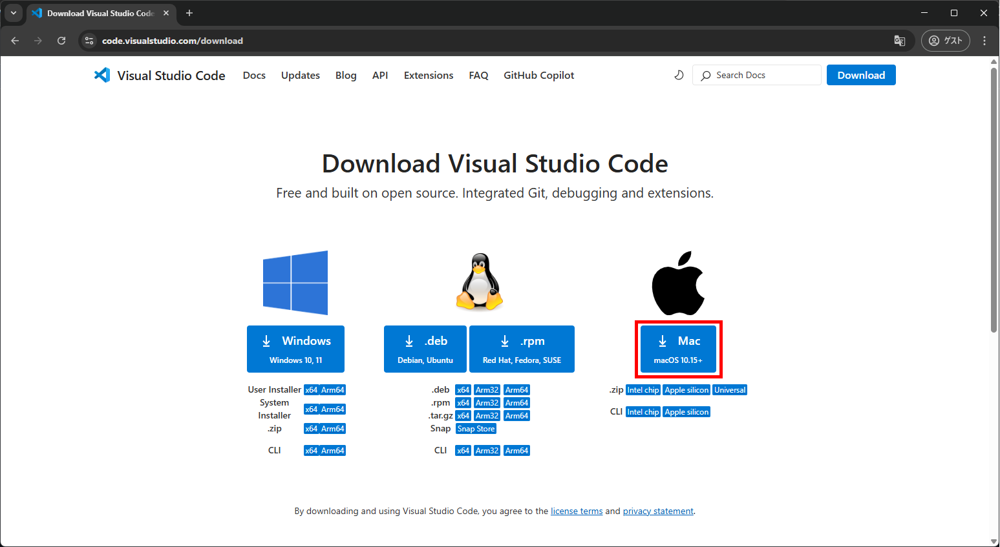

import { Aside, Steps, Tabs, TabItem, LinkCard } from '@astrojs/starlight/components'
import SyscatComment from "@/components/SyscatComment.astro"
export const CLI_OR_GUI_SYNC_KEY = 'c-lang/beginner::cli-or-gui';
export const COMPILER_SYNC_KEY = 'c-lang/beginner::compiler';

## 私はどの環境で開発すれば？

過去の講義資料を基にしたゆる～い案内です。 確実に授業に即しているかは分からないけど、自分の PC などで試すときは参考にしてください。

- EE （電気学科/電気工学専攻）  
   <LinkCard
      title="“VSBT 経由の MSVC” の節へ"
      href="#vsbt-経由の-msvcclexe"
   />

- EV （電気学科/電子情報工学専攻）  
   <LinkCard
      title="“w64devkit 経由の MinGW” の節へ"
      href="#w64devkit-経由の-mingw"
   />
- KK （情報科学科/コンピュータシステム専攻）  
   <LinkCard
   title="“構築: エディター環境 - XCode” の節へ"
   href="#xcode"
   />
- KX （情報科学科/メディア情報専攻）  
   <LinkCard
   title="“構築: エディター環境 - XCode” の節へ"
   href="#xcode"
   />


## 構築: コンパイラー環境

### Windows 

<Aside type="tip" title="用語">

- VSBT（Visual Studio Build Tools）  
   Visual C++ のコンパイラーを含む、プログラムのコンパイルをコマンドラインから行なうツールセット
- Visual Studio Installer  
   VSBT を構成する各種コンポーネントの インストール/アンインストール を行うツール
- PowerShell  
   Windows に標準でインストールされているコマンドラインツール

</Aside>

#### VSBT 経由の MSVC（`cl.exe`）

<Steps>

1. Visual Studio Installer をインストールする  

   <Tabs syncKey={CLI_OR_GUI_SYNC_KEY}>
      <TabItem label="CLI">

      <kbd>Win</kbd> → `powershell` → <kbd>Enter</kbd> で PowerShell を起動します（ショートカット: <kbd>Win</kbd> + <kbd>X</kbd> → <kbd>I</kbd>）。  
      その後、次のコマンドを実行して Visual Studio Installer をインストールします [^vsbt-winget]:

      ```powershell
      winget install Microsoft.VisualStudio.2022.BuildTools
      ```

      インストールの完了後、自動的に Visual Studio Installer が起動します。
      もし起動しない場合は、スタートメニューから “Visual Studio Installer” を検索して起動してください。

      </TabItem>
      <TabItem label="GUI">
      [Build Tools for Visual Studio 2022 - Microsoft](https://visualstudio.microsoft.com/ja/downloads/#build-tools-for-visual-studio-2022) にアクセスし、“ダウンロード” ボタンをクリックします。  
      その後、ダウンロードされた `vs_BuildTools.exe` をクリックし、Visual Studio Installer を起動します。
      </TabItem>
   </Tabs>

2. VSBT をインストールする  

   “C++ によるデスクトップ開発” にチェックを入れ、
   - “MSVC v143 - VS 2022 C++ x64/x86 ビルド ツール（最新）”  
      （バージョンは変動する可能性アリ）
   - “Windows 用 C++ CMake ツール”  

   の 2 つにチェックを入れます。その後、“変更” をクリックします。

   

   インストールが完了するまで待機します。
   

   <SyscatComment type="SLEEPING">PC やネットワークの速度によっては時間を要するから、お茶でも飲んでゆっくり待ってね。</SyscatComment>

3. MSVC のバージョンを特定する

   <Tabs syncKey={CLI_OR_GUI_SYNC_KEY}>
      <TabItem label="CLI">

      PowerShell で次のコマンドを実行し、どのバージョンがインストールされているかを確認します:

      ```powershell
      ls -name "C:\Program Files (x86)\Microsoft Visual Studio\2022\BuildTools\VC\Tools\MSVC"
      ```

      すると、次のような出力が得られます（例）:

      ```powershell
      14.43.34808
      ```

      これが、MSVC のバージョン番号の一例です。 これをメモしておきます。

      <Aside>
         Visual Studio Installer でインストールする際、“インストールの場所” を変更した際は、`ls` の引数のパスを変更する必要があります。
      </Aside>

      </TabItem>
      <TabItem label="GUI">

      エクスプローラーで、MSVC が含まれるフォルダー
      ```text
      C:\Program Files (x86)\Microsoft Visual Studio\2022\BuildTools\VC\Tools\MSVC
      ```
      に移動します。 (ショートカット: パスをコピー後、<kbd>Win</kbd> + <kbd>R</kbd> → <kbd>Ctrl</kbd> + <kbd>V</kbd> → <kbd>Enter</kbd>)
      
      

      作業フォルダー内にあるフォルダーの名前が MSVC のバージョン番号の一例です。 これをメモしておきます。

      <Aside>
         Visual Studio Installer でインストールする際、“インストールの場所” を変更した際は、“ファイル名を指定して実行” のパスを変更する必要があります。
      </Aside>

      </TabItem>
   </Tabs>


4. 環境変数を設定する  

   MSVC のバージョンが特定できたら、次に示すパス中の緑の箇所を特定したバージョンに置き換え、クリップボードやメモ帳などにコピーしておきます [^vsbt-path]:
   ```text ins="{MSVC ver.}"
   C:\Program Files (x86)\Microsoft Visual Studio\2022\BuildTools\VC\Tools\MSVC\{MSVC ver.}\bin\Hostx64\x64
   ```

   e.g. `14.43.34808`:
   ```text ins="14.43.34808"
   C:\Program Files (x86)\Microsoft Visual Studio\2022\BuildTools\VC\Tools\MSVC\14.43.34808\bin\Hostx64\x64
   ```

   パスの準備ができたら、 <kbd>Win</kbd> → `env` で “環境変数を編集” を起動します。  
   その後、ユーザー環境変数セクションの `Path` (下図の赤枠) をダブルクリックします。
   

   すると、次のようなウィンドウが開きます。
   
   ここで、“新規” ボタンをクリックし、先ほどコピーしたパスを貼り付け、“OK” → “OK” で 2 つのウィンドウを閉じます。

   <SyscatComment>今回は必ずしも PATH を通す必要はないんだけど、 IDE やツールチェインによっては必要になるから、やっておいて損は無いはず！</SyscatComment>

5. `cl.exe` を実行してみる

   <kbd>Win</kbd> → `developer powershell` → <kbd>Enter</kbd> で、Developer PowerShell for VS 2022 を起動します（Developer Command Prompt for VS 2022 でも問題ありません）。
   その後、`cl` コマンドを実行してみます。

   ```powershell
   **********************************************************************
   ** Visual Studio 2022 Developer PowerShell v17.13.5
   ** Copyright (c) 2022 Microsoft Corporation
   **********************************************************************

   PS C:\Program Files (x86)\Microsoft Visual Studio\2022\BuildTools> cl
   
   Microsoft(R) C/C++ Optimizing Compiler Version 19.43.34809 for x86
   Copyright (C) Microsoft Corporation.  All rights reserved.

   使い方: cl [ オプション... ] ファイル名... [ /link リンク オプション... ]
   ```

   上のようなメッセージが表示されれば、インストールは成功です。
</Steps>

<SyscatComment type="TADA">これでコンパイラー環境の構築は終わりだよ。 お疲れ様！</SyscatComment>
<LinkCard
  title="“構築: エディター環境” の節へ"
  href="#構築-エディター環境"
  description="ここより下は別のコンパイラー環境用だよ！"
/>

#### VSBT 経由の Clang/LLVM （`clang.exe`）
   
<Steps>

1. Visual Studio Installer をインストールする  

   <Tabs syncKey={CLI_OR_GUI_SYNC_KEY}>
      <TabItem label="CLI">

      <kbd>Win</kbd> → `powershell` → <kbd>Enter</kbd> で PowerShell を起動します（ショートカット: <kbd>Win</kbd> + <kbd>X</kbd> → <kbd>I</kbd>）。  
      その後、次のコマンドを実行して Visual Studio Installer をインストールします [^vsbt-winget]:

      ```powershell
      winget install Microsoft.VisualStudio.2022.BuildTools
      ```

      インストールの完了後、自動的に Visual Studio Installer が起動します。
      もし起動しない場合は、スタートメニューから “Visual Studio Installer” を検索して起動してください。

      </TabItem>
      <TabItem label="GUI">
      [Build Tools for Visual Studio 2022 - Microsoft](https://visualstudio.microsoft.com/ja/downloads/#build-tools-for-visual-studio-2022) にアクセスし、“ダウンロード” ボタンをクリックします。  
      その後、ダウンロードされた `vs_BuildTools.exe` をクリックし、Visual Studio Installer を起動します。
      </TabItem>
   </Tabs>

2. VSBT をインストールする  

   “C++ によるデスクトップ開発” にチェックを入れ、
   - “MSVC v143 - VS 2022 C++ x64/x86 ビルド ツール（最新）”  
      （バージョンは変動する可能性アリ）
   - “Windows 用 C++ CMake ツール”
   - “Windows 用 C++ Clang ツール (19.1.1 - x64/x86)”  
      （バージョンは変動する可能性アリ）

   の 3 つにチェックを入れます [^vsbt-llvm]。 その後、“変更” をクリックします。

   

   インストールが完了するまで待機します。
   

   <SyscatComment type="SLEEPING">PC やネットワークの速度によっては時間を要するから、お茶でも飲んでゆっくり待ってね。</SyscatComment>

3. 環境変数を設定する  

   次のパスをクリップボードやメモ帳などにコピーしておきます [^vsbt-llvm]:
   ```
   C:\Program Files (x86)\Microsoft Visual Studio\2022\BuildTools\VC\Tools\Llvm\bin
   ```

   パスの準備ができたら、 <kbd>Win</kbd> → `env` で “環境変数を編集” を起動します。  
   その後、ユーザー環境変数セクションの `Path` (下図の赤枠) をダブルクリックします。
   

   すると、次のようなウィンドウが開きます。
   
   ここで、“新規” ボタンをクリックし、先ほどコピーしたパスを貼り付け、“OK” → “OK” で 2 つのウィンドウを閉じます。

   <SyscatComment>今回は必ずしも PATH を通す必要はないんだけど、 IDE やツールチェインによっては必要になるから、やっておいて損は無いはず！</SyscatComment>

4. `clang.exe` を実行してみる

   <kbd>Win</kbd> → `developer powershell` → <kbd>Enter</kbd> で、Developer PowerShell for VS 2022 を起動します（Developer Command Prompt for VS 2022 でも問題ありません）。
   その後、`clang` コマンドを実行してみます。

   ```powershell
   **********************************************************************
   ** Visual Studio 2022 Developer PowerShell v17.13.5
   ** Copyright (c) 2022 Microsoft Corporation
   **********************************************************************

   PS C:\Program Files (x86)\Microsoft Visual Studio\2022\BuildTools> clang
   
   clang: error: no input files
   ```

   上のようなメッセージが表示されれば、インストールは成功です。
</Steps>

<SyscatComment type="TADA">これでコンパイラー環境の構築は終わりだよ。 お疲れ様！</SyscatComment>
<LinkCard
  title="“構築: エディター環境” の節へ"
  href="#構築-エディター環境"
  description="ここより下は別のコンパイラー環境用だよ！"
/>

#### w64devkit 経由の MinGW

<Steps>

1. w64devkit のダウンロード  

   [w64devkit - @skeeto - GitHub](https://github.com/skeeto/w64devkit/releases) にアクセスし、
   最新のリリースの Assets から `w64devkit-x64-2.1.0.exe` をダウンロードします （バージョンは変動する可能性アリ） [^mingw-install]。

   該当の EXE ファイルを**管理者として**起動します。
   

   その後、展開先を示すフィールドを
   ```text
   C:\Program Files
   ```
   に変更し、 “Extract” ボタンをクリックします。
   

   <Aside>
      展開先に強い制約や意図はありません。もし、展開先がユーザープロファイル内の場合、展開に管理者権限は不要です。したがってその場合、管理者として実行することすら不要です。
   </Aside>

2. 環境変数を設定する  

   次のパスをクリップボードやメモ帳などにコピーしておきます [^vsbt-llvm]:
   ```
   C:\Program Files\w64devkit\bin
   ```

   パスの準備ができたら、 <kbd>Win</kbd> → `env` で “環境変数を編集” を起動します。  
   その後、ユーザー環境変数セクションの `Path` (下図の赤枠) をダブルクリックします。
   

   すると、次のようなウィンドウが開きます。
   
   ここで、“新規” ボタンをクリックし、先ほどコピーしたパスを貼り付け、“OK” → “OK” で 2 つのウィンドウを閉じます。

3. `gcc.exe` を実行してみる

   <kbd>Win</kbd> → `powershell` → <kbd>Enter</kbd> で PowerShell を起動します（ショートカット: <kbd>Win</kbd> + <kbd>X</kbd> → <kbd>I</kbd>）。  
   その後、`gcc` コマンドを実行してみます。

   ```powershell
   PowerShell 7.5.0
   PS C:\Program Files\PowerShell\7> gcc
   gcc.exe: fatal error: no input files
   compilation terminated.
   ```

   上のようなメッセージが表示されれば、インストールは成功です。
</Steps>

<SyscatComment type="TADA">これでコンパイラー環境の構築は終わりだよ。 お疲れ様！</SyscatComment>
<LinkCard
  title="“構築: エディター環境” の節へ"
  href="#構築-エディター環境"
  description="ここより下は別のコンパイラー環境用だよ！"
/>


### macOS

後述する XCode をインストールすると、 GCC を含んだ XCode Command Line Tools がインストールされるので、この節はスキップして構いません。  

<LinkCard
  title="“構築: エディター環境 - XCode” の節へ"
  href="#構築-エディター環境"
/>

XCode を使わずにコーディングする場合や、 Clang へのリダイレクトなしの GCC を使う場合は、次の手順に従ってください。
また、HomeBrew がインストールされていない場合は, [こちらの記事](https://zenn.dev/ackylarkham/articles/c93d5ed1689459) を参考にインストールしてください。

#### GCC

次のコマンドで GCC の実体を確認します。

```bash
gcc --version
```

次に出力例を示します:

```text "clang"
Apple clang version 16.0.0 (clang-1600.0.26.6)
Target: arm64-apple-darwin23.5.0
Thread model: posix
InstalledDir: /Applications/Xcode-16.2.0.app/Contents/Developer/Toolchains/XcodeDefault.xctoolchain/usr/bin
```

このように、デフォルトでは、 GCC と言いつつ実体は Clang であることが分かります。
なので、このセクションでは HomeBrew を用いてピュアな GCC をインストールします。

次のコマンドを実行して、 HomeBrew 経由で GCC をインストールします [^gcc-install-on-macos]。

<Steps>

1. gcc のインストール  
   ```bash
   brew install gcc
   ```

2. gcc のバージョン確認  
   ```bash
   ls /usr/local/bin | grep gcc
   ```
   次に出力例を示します:
   ```text "11"
   gcc-11
   gcc-ar-11
   gcc-nm-11
   gcc-ranlib-11
   x86_64-apple-darwin21-gcc-11
   x86_64-apple-darwin21-gcc-ar-11
   x86_64-apple-darwin21-gcc-nm-11
   x86_64-apple-darwin21-gcc-ranlib-11
   ```
   PATH の通っている gcc のバージョンが 11 であると確認できました。

3. `/usr/local/bin/` にシンボリックリンクを作成
   ```bash "11"
   ln -s /usr/local/bin/gcc-11 /usr/local/bin/gcc
   ```
4. GCC の実体を確認
   ```bash
   gcc --version
   ```
   次に出力例を示します:
   
   ```text "GCC"
   gcc-14 (Homebrew GCC 14.2.0_1) 14.2.0
   Copyright (C) 2024 Free Software Foundation, Inc.
   This is free software; see the source for copying conditions.  There is NO
   warranty; not even for MERCHANTABILITY or FITNESS FOR A PARTICULAR PURPOSE.
   ```

</Steps>

#### Clang

### Linux

#### GCC

スーパーユーザーとして次のコマンドを実行します [^build-essential-install]。 WSL を使う場合も有効です。

<Steps>

1. リポジトリのアップデート  
   ```bash
   sudo apt-get update
   sudo apt-get upgrade
   ```
2. build-essential のインストール  
   ```bash
   sudo apt-get install build-essential
   ```
3. GCC のバージョン確認  
   ```bash
   gcc --version
   ```

</Steps>
<SyscatComment type="TADA">これでコンパイラー環境の構築は終わりだよ。 お疲れ様！</SyscatComment>
<LinkCard
  title="“構築: エディター環境” の節へ"
  href="#構築-エディター環境"
  description="ここより下は別のコンパイラー環境用だよ！"
/>


#### Clang

スーパーユーザーとして次のコマンドを実行します [^clang-install]。 WSL を使う場合も有効です。

<Steps>

1. リポジトリのアップデート
   ```bash
   sudo apt-get update
   sudo apt-get upgrade
   ```
2. Clang のインストール
   ```bash
   sudo apt-get install clang
   ```
3. Clang のバージョン確認
   ```bash
   clang --version
   ```

</Steps>
<SyscatComment type="TADA">これでコンパイラー環境の構築は終わりだよ。 お疲れ様！</SyscatComment>
<LinkCard
  title="“構築: エディター環境” の節へ"
  href="#構築-エディター環境"
/>


## 構築: エディター環境

### VSCode

<Tabs>
   <TabItem label="Windows">
   <Tabs syncKey={CLI_OR_GUI_SYNC_KEY}>
      <TabItem label="CLI">

      <kbd>Win</kbd> → `powershell` → <kbd>Enter</kbd> で PowerShell を起動します（ショートカット: <kbd>Win</kbd> + <kbd>X</kbd> → <kbd>I</kbd>）。  
      その後、次のコマンドを実行して Visual Studio Code をインストールします [^vscode-install]:

      ```powershell
      winget install Microsoft.VisualStudioCode
      ```

      インストールの完了後、自動的に Visual Studio Code が起動します。
      もし起動しない場合は、スタートメニューから “Visual Studio Code” を検索して起動してください。

      </TabItem>
      <TabItem label="GUI">

      [Download - Visual Studio Code](https://code.visualstudio.com/download) にアクセスし、 “Windows” ボタンをクリックします。

      

      インストーラー `VSCodeUserSetup-x64-x.xx.x.exe` を起動し、セットアップの指示に従ってインストールを進めます。
      
      </TabItem>
   </Tabs>
   </TabItem>

   <TabItem label="macOS">
   <Tabs syncKey={CLI_OR_GUI_SYNC_KEY}>
      <TabItem label="CLI">

      VSCode は、HomeBrew Cask を使ってインストールすることができます。  
      もし HomeBrew がインストールされていない場合は, [こちらの記事](https://zenn.dev/ackylarkham/articles/c93d5ed1689459) を参考にインストールしてください。

      ```bash
      brew install --cask visual-studio-code
      ```

      </TabItem>
      <TabItem label="GUI">

      [Download - Visual Studio Code](https://code.visualstudio.com/download) にアクセスし、 “Windows” ボタンをクリックします。

      
      
      インストーラー `VSCodeUserSetup-x64-x.xx.x.exe` を起動し、セットアップの指示に従ってインストールを進めます。

      </TabItem>
   </Tabs>
   </TabItem>
   
   <TabItem label="Linux">

   次に示すページを参考に、Linux 用の Visual Studio Code をインストールしてください:

   <LinkCard
      title="Linux 用 Visual Studio Code のインストール"
      description="【Windows, Mac, Linux】OS別のVSCodeインストール方法まとめ - @c60evaporator - Qiita"
      href="https://qiita.com/c60evaporator/items/90c071465eb82a12f6be#linux%E3%81%AE%E5%A0%B4%E5%90%88"
      target="_blank"
      rel="noopener noreferrer"
   />

   </TabItem>

</Tabs>

### XCode

<Aside type="caution">
   XCode は、非常に容量の大きなソフトウェアです！  インストール前の時点で、ストレージを 10 GB 以上確保する必要があります。 また、インストールには Apple Account が必要です。
</Aside>
<SyscatComment type="HUMAN">
   情報科学部の学部生に対して配布される MacBook のストレージ容量は、基本的に 256 GB。
   XCode を使う講義も多いから、容量が足りない子は今後のためにも、クラウド/外部 ストレージを使うなどして、頑張って空けておこう！
</SyscatComment>

<Tabs syncKey={CLI_OR_GUI_SYNC_KEY}>
   <TabItem label="CLI">

   VSCode は、HomeBrew Cask を使ってインストールすることができます。  
   もし HomeBrew がインストールされていない場合は, [こちらの記事](https://zenn.dev/ackylarkham/articles/c93d5ed1689459) を参考にインストールしてください。


   </TabItem>
   <TabItem label="GUI">

   次に示すページを参考に、AppStore から XCode をインストールしてください:
   
   <LinkCard
      title="AppStore から XCode をインストールする"
      description="Xcodeをインストールする - @joho0724 - Zenn"
      href="https://zenn.dev/joho0724/articles/sankaku0724-newcreate32"
      target="_blank"
      rel="noopener noreferrer"
   />

   </TabItem>
</Tabs>

---

[^vsbt-winget]: [開発環境: WindowsにRust(MSVC)の開発環境を構築する (2023年版) - @atsushifx - Zenn](https://zenn.dev/atsushifx/articles/develop-lang-rust-install#1.-visual-studio-build-tools%E3%81%AE%E3%82%A4%E3%83%B3%E3%82%B9%E3%83%88%E3%83%BC%E3%83%AB)
[^vsbt-path]: [開発環境: Visual Studio Build Toolsのインストール手順ガイド - @atsushifx - Zenn](https://zenn.dev/atsushifx/articles/winhack-develop-buildtools-install#3.1.-%E3%83%91%E3%82%B9%E3%81%AE%E8%A8%AD%E5%AE%9A)
[^vsbt-llvm]: [llvm-mingw(clang) + ninja + cmake で Windows で self-contained な C/C++ 開発環境を整える - @syoyo - Qiita](https://qiita.com/syoyo/items/48c4b7af14fdd8d2c741)
[^mingw-install]: [WindowsにMinGW-w64をインストールする 2025年版 - @yomei_o - Qiita](https://qiita.com/yomei_o/items/2e706a5fa3ac5ffc3a50)
[^gcc-install-on-macos]: [MacでGCCを使用し、C/C++のコードをコンパイルする - @minguu42 - Zenn](https://zenn.dev/minguu42/articles/20220722-how-to-use-gcc-on-mac)
[^build-essential-install]: [スタンドアロンのUbuntuにbuild-essentialをインストール - @ryo2_9393 - Qiita](https://qiita.com/ryo2_9393/items/78fd73718b391b564083)
[^clang-install]: [UbuntuにClangをインストール - tah](https://tah5.com/guides/ubuntu/llvm/clang/ubuntu24/)
[^vscode-install]: [Getting Started with VS Code - VSCode Essentials](https://microsoft.github.io/vscode-essentials/en/01-getting-started.html)
