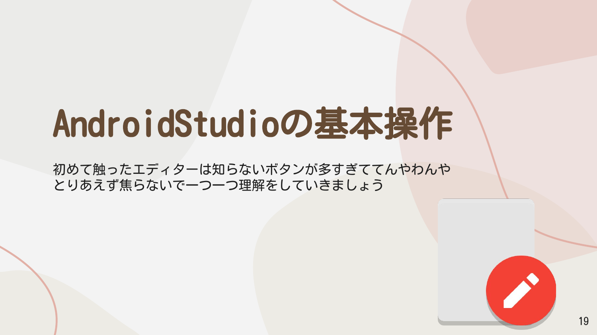
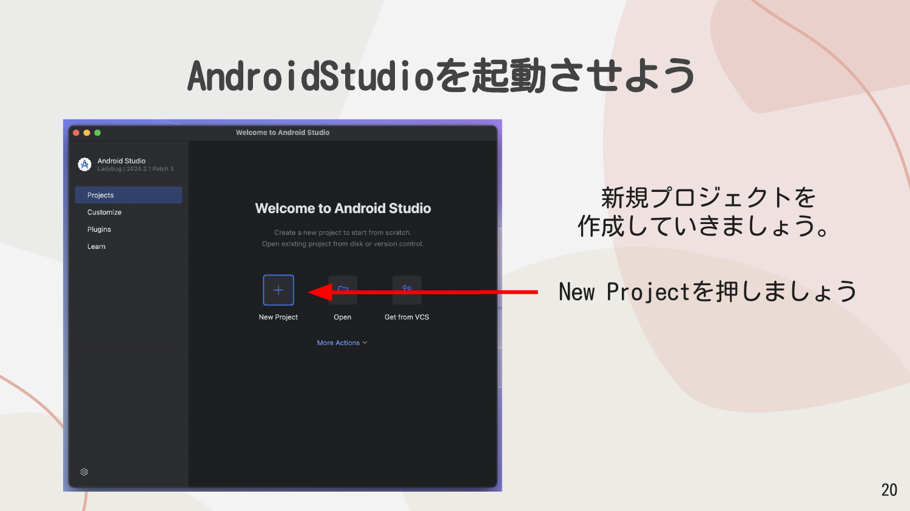
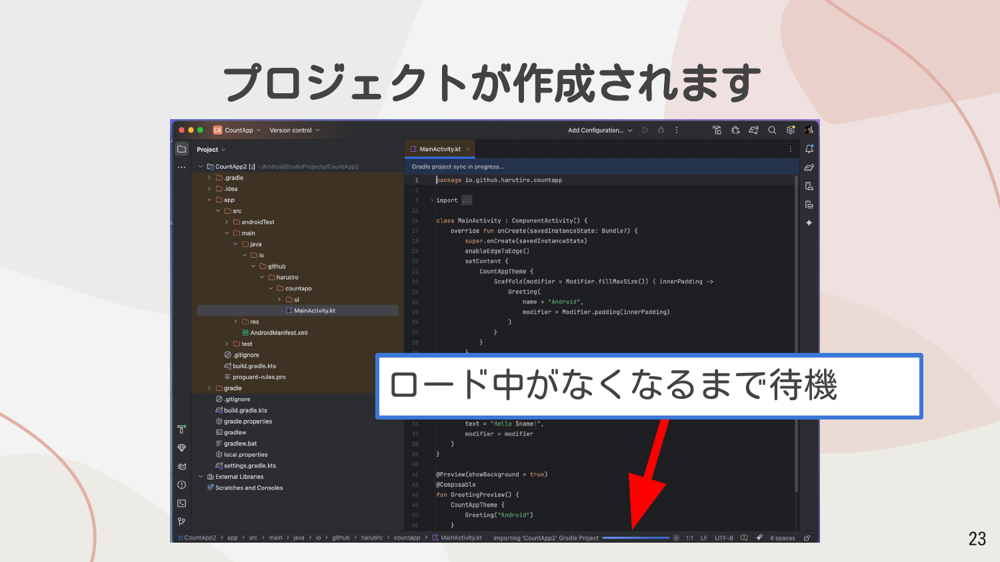
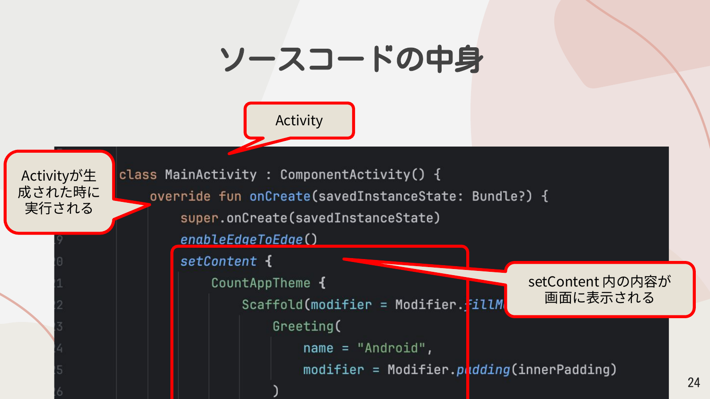
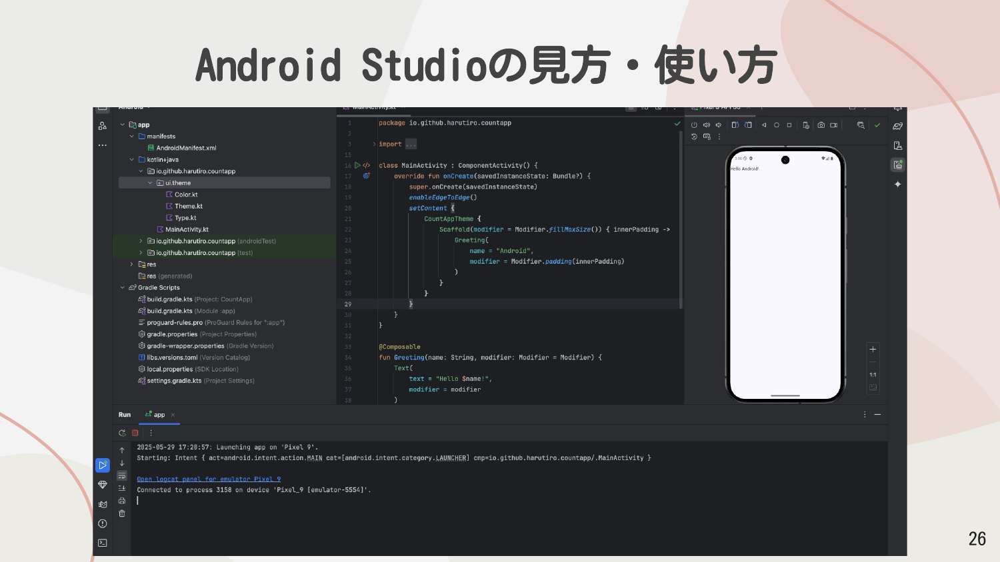
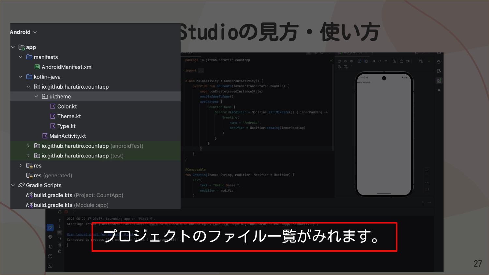
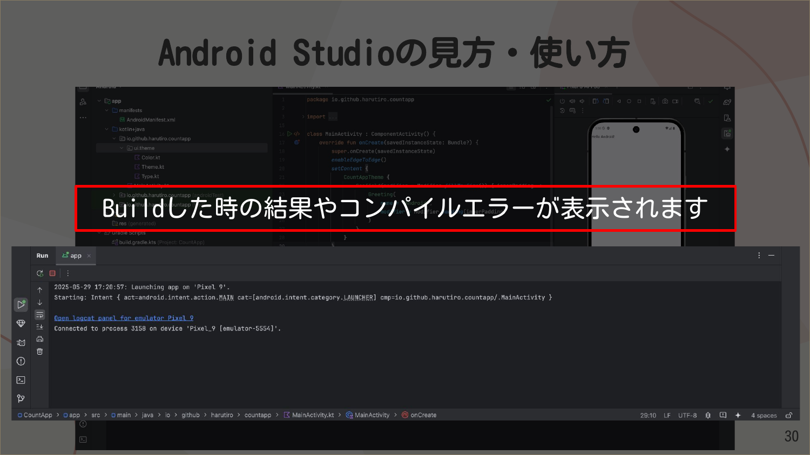
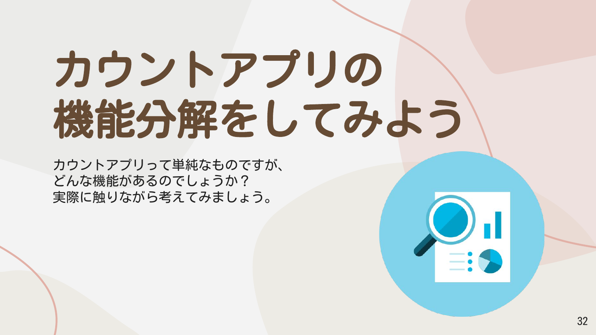
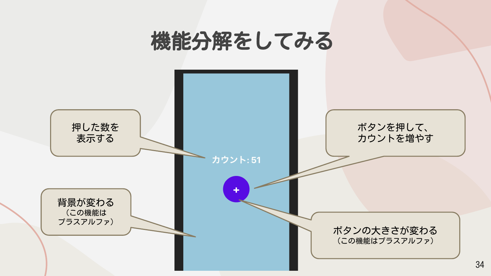

import { Aside } from "@astrojs/starlight/components";

## Android Studioの基本操作

初めて触ったエディターは知らないボタンが多すぎててんやわんやとなりがちです。とりあえず焦らないで一つ一つ理解をしていきましょう。



## Android Studioを起動させよう

Android Studioを起動すると、「Welcome to Android Studio」というウェルカム画面が表示されます。

ここでは以下の操作ができます：

- **New Project** - 新規プロジェクトを作成
- **Open** - 既存のプロジェクトを開く
- **Get from VCS** - バージョン管理システムからプロジェクトを取得

新規プロジェクトを作成していきましょう。**New Project**を押しましょう。



## テンプレートを選択しよう

New Projectを押すと、テンプレート選択画面が表示されます。テンプレートは最初の初期設定や、初期コードを用意してくれます。

左側のメニューでは対象デバイスを選択できます：
- Phone and Tablet
- Wear OS
- Television
- Automotive

今回は「Phone and Tablet」を選択した状態で、**Empty Activity**を押してください。ルービックキューブみたいなアイコンが目印です。


<Aside>
Empty Activityを選択すると、Jetpack Composeを使った最小限のプロジェクトが作成されます。
</Aside>

## プロジェクトの設定をしよう

Empty Activityを選択してNextを押すと、プロジェクトの設定画面が表示されます。

| 項目 | 説明 | 例 |
|------|------|------|
| **Name** | プロジェクトの名前 | CountApp |
| **Package name** | パッケージの名前。今回は、GitHubのURLを逆順で書くことにする | io.github.harutiro.countapp |
| **Save location** | 保存される場所 | /Users/harutiro/AndroidStudioProjects/CountApp |
| **Minimum SDK** | 対応するOSバージョン（API 24） | API 24 ("Nougat"; Android 7.0) |
| **Build configuration language** | ビルド設定の言語 | Kotlin DSL (build.gradle.kts) [Recommended] |


<Aside type="tip">
Minimum SDKをAPI 24に設定すると、約97.4%のデバイスでアプリが動作します。「Help me choose」リンクをクリックすると、各APIレベルでのカバー率を確認できます。
</Aside>

設定が完了したら**Finish**を押そう。

## プロジェクトが作成されます

Finishを押すと、Android Studioがプロジェクトを作成し、必要なファイルをセットアップします。

画面下部に「Importing 'CountApp' Gradle Project...」などのメッセージが表示されます。**ロード中がなくなるまで待機**してください。



<Aside type="caution">
初回のプロジェクト作成時は、Gradleの同期やSDKのダウンロードに時間がかかることがあります。インターネット接続が必要です。
</Aside>

## ソースコードの中身

プロジェクトが作成されると、`MainActivity.kt`ファイルが開きます。基本的な構造を見てみましょう。

### Activityの構造

```kotlin
class MainActivity : ComponentActivity() {
    override fun onCreate(savedInstanceState: Bundle?) {
        super.onCreate(savedInstanceState)
        enableEdgeToEdge()
        setContent {
            CountAppTheme {
                Scaffold(modifier = Modifier.fillMaxSize()) { innerPadding ->
                    Greeting(
                        name = "Android",
                        modifier = Modifier.padding(innerPadding)
                    )
                }
            }
        }
    }
}
```

- **Activity** - Androidアプリの画面を管理するクラス
- **onCreate** - Activityが生成された時に実行される
- **setContent** - setContent内の内容が画面に表示される



### Composable関数

```kotlin
@Composable
fun Greeting(name: String, modifier: Modifier = Modifier) {
    Text(
        text = "Hello $name!",
        modifier = modifier
    )
}
```

`@Composable`アノテーションが付いた関数は、Jetpack Composeで画面のUIを構築するための関数です。詳細は後述します。


## Android Studioの見方・使い方

Android Studioの画面は主に以下の領域で構成されています。



### プロジェクトパネル（左側）

プロジェクトのファイル一覧がみれます。

主なフォルダ構成：
- **app** - アプリのメインモジュール
  - **manifests** - AndroidManifest.xml（アプリの設定ファイル）
  - **kotlin+java** - Kotlinソースコード
    - パッケージ名のフォルダ - メインのソースコード
    - ui.theme - テーマ関連のファイル（Color.kt, Theme.kt, Type.kt）
  - **res** - リソースファイル（画像、レイアウトなど）
- **Gradle Scripts** - ビルド設定ファイル



### エディター（中央）

ソースコードを記述する場所です。

`MainActivity.kt`などのファイルを開いて、コードを編集できます。


### エミュレーター（右側）

Androidのエミュレータが動くところです。実際のAndroidデバイスがなくても、エミュレーターを使ってアプリをテストできます。

エミュレーターには「Pixel 9 API 35」などのデバイス名が表示され、実際のスマートフォンのように操作できます。


### Runパネル（下部）

Buildした時の結果やコンパイルエラーが表示されます。

アプリを実行すると、以下のような情報が表示されます：
```
Launching app on 'Pixel 9'.
Starting: Intent { act=android.intent.action.MAIN cat=[android.intent.category.LAUNCHER] cmp=io.github.harutiro.countapp/.MainActivity }
Connected to process on device 'Pixel_9 [emulator-5554]'.
```



### Logcat（下部タブ）

Logcatと呼ばれる、端末のログを表示するパネルです。

アプリの動作中に出力されるログメッセージを確認できます。デバッグ時に非常に役立ちます。


## カウントアプリの機能分解をしてみよう

カウントアプリって単純なものですが、どんな機能があるのでしょうか？実際に触りながら考えてみましょう。



### 実際に触ってみよう

以下のWebサイトにアクセスして、実際にカウントアプリを触ってみましょう。

**https://countappreact.pages.dev/**


<Aside type="tip">
これはViteで作ったWebアプリです。スマートフォンやPCのブラウザからアクセスできます。
</Aside>

### 機能分解をしてみる

カウントアプリの機能を分解すると、以下のようになります：

| 機能 | 説明 |
|------|------|
| 押した数を表示する | 画面中央に「カウント: 51」のように表示 |
| ボタンを押して、カウントを増やす | +ボタンをタップするとカウントが増える |
| 背景が変わる | この機能はプラスアルファ |
| ボタンの大きさが変わる | この機能はプラスアルファ |



### 流れを考えてみる

カウントアプリの基本的な流れは以下の通りです：

1. **ボタンを押す**
2. **値を一つ増やす**
3. **値を表示する**


<Aside type="note">
アプリの必要な機能を作り、その機能がどのような動きをするのかをまとめるのが大切です。
</Aside>


この考え方は、アプリ開発全般において重要です。作りたいアプリの機能を分解し、それぞれの機能がどのような動作をするのかを整理してから実装に取り掛かりましょう。
