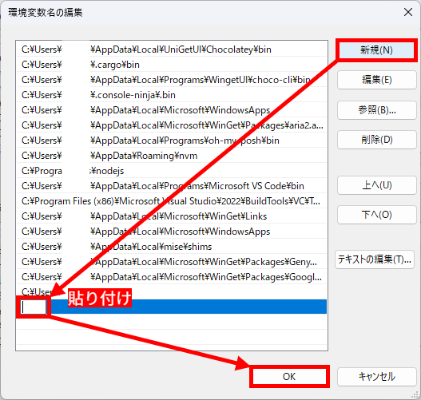
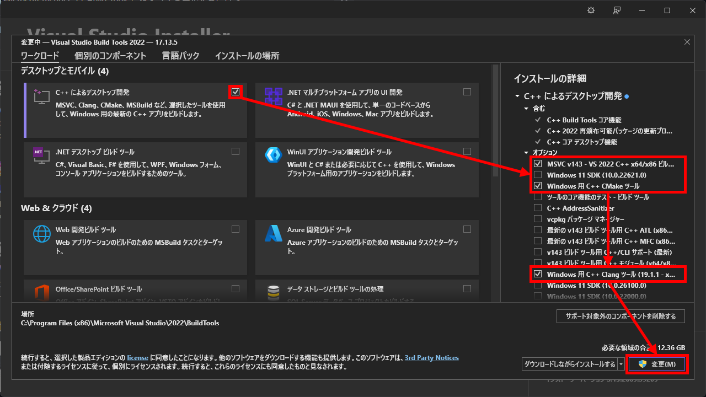

import { Aside, Steps, Tabs, TabItem, LinkCard } from '@astrojs/starlight/components'
import SyscatComment from "@/components/SyscatComment.astro"
export const CLI_OR_GUI_SYNC_KEY = 'c-lang/beginner::cli-or-gui';

## 私はどの環境で開発すれば？

## 構築: コンパイラー環境

### Windows 

<Aside type="tip" title="用語">

- VSBT（Visual Studio Build Tools）  
   Visual C++ のコンパイラーを含む、プログラムのコンパイルをコマンドラインから行なうツールセット
- Visual Studio Installer  
   VSBT を構成する各種コンポーネントの インストール/アンインストール を行うツール
- PowerShell  
   Windows に標準でインストールされているコマンドラインツール

</Aside>

#### VSBT 経由の MSVC（`cl.exe`）

<Steps>

1. Visual Studio Installer をインストールする  

   <Tabs syncKey={CLI_OR_GUI_SYNC_KEY}>
      <TabItem label="CLI">

      <kbd>Win</kbd> → `powershell` → <kbd>Enter</kbd> で PowerShell を起動します（ショートカット: <kbd>Win</kbd> + <kbd>X</kbd> → <kbd>I</kbd>）。  
      その後、次のコマンドを実行して Visual Studio Installer をインストールします [^vsbt-winget]:

      ```powershell
      winget install Microsoft.VisualStudio.2022.BuildTools
      ```

      インストールの完了後、自動的に Visual Studio Installer が起動します。
      もし起動しない場合は、スタートメニューから “Visual Studio Installer” を検索して起動してください。

      </TabItem>
      <TabItem label="GUI">
      [Build Tools for Visual Studio 2022 - Microsoft](https://visualstudio.microsoft.com/ja/downloads/#build-tools-for-visual-studio-2022) にアクセスし、“ダウンロード” ボタンをクリックします。  
      その後、ダウンロードされた `vs_BuildTools.exe` をクリックし、Visual Studio Installer を起動します。
      </TabItem>
   </Tabs>

2. VSBT をインストールする  

   “C++ によるデスクトップ開発” にチェックを入れ、
   - “MSVC v143 - VS 2022 C++ x64/x86 ビルド ツール（最新）”  
      （バージョンは変動する可能性アリ）
   - “Windows 用 C++ CMake ツール”  

   の 2 つにチェックを入れます。その後、“変更” をクリックします。

   

   インストールが完了するまで待機します。
   

   <SyscatComment>PC やネットワークの速度によっては時間を要するから、お茶でも飲んでゆっくり待ってね。</SyscatComment>

3. MSVC のバージョンを特定する

   <Tabs syncKey={CLI_OR_GUI_SYNC_KEY}>
      <TabItem label="CLI">

      PowerShell で次のコマンドを実行し、どのバージョンがインストールされているかを確認します:

      ```powershell
      ls -name "C:\Program Files (x86)\Microsoft Visual Studio\2022\BuildTools\VC\Tools\MSVC"
      ```

      すると、次のような出力が得られます (例):

      ```powershell
      14.43.34808
      ```

      これが、MSVC のバージョン番号の一例です。これをメモしておきます。

      <Aside>
         Visual Studio Installer でインストールする際、“インストールの場所” を変更した際は、`ls` の引数のパスを変更する必要があります。
      </Aside>

      </TabItem>
      <TabItem label="GUI">

      エクスプローラーで、MSVC が含まれるフォルダー
      ```text
      C:\Program Files (x86)\Microsoft Visual Studio\2022\BuildTools\VC\Tools\MSVC
      ```
      に移動します。  (ショートカット: パスをコピー後、<kbd>Win</kbd> + <kbd>R</kbd> → <kbd>Ctrl</kbd> + <kbd>V</kbd> → <kbd>Enter</kbd>)
      
      

      作業フォルダー内にあるフォルダーの名前が MSVC のバージョン番号の一例です。これをメモしておきます。

      <Aside>
         Visual Studio Installer でインストールする際、“インストールの場所” を変更した際は、“ファイル名を指定して実行” のパスを変更する必要があります。
      </Aside>

      </TabItem>
   </Tabs>


4. 環境変数を設定する  

   MSVC のバージョンが特定できたら、次に示すパス中の緑の箇所を特定したバージョンに置き換え、クリップボードやメモ帳などにコピーしておきます [^vsbt-path]:
   ```text ins="{MSVC ver.}"
   C:\Program Files (x86)\Microsoft Visual Studio\2022\BuildTools\VC\Tools\MSVC\{MSVC ver.}\bin\Hostx64\x64
   ```

   e.g. `14.43.34808`:
   ```text ins="14.43.34808"
   C:\Program Files (x86)\Microsoft Visual Studio\2022\BuildTools\VC\Tools\MSVC\14.43.34808\bin\Hostx64\x64
   ```

   パスの準備ができたら、 <kbd>Win</kbd> → `env` で “環境変数を編集” を起動します。  
   その後、ユーザー環境変数セクションの `Path` (下図の赤枠) をダブルクリックします。
   

   すると、次のようなウィンドウが開きます。
   
   ここで、“新規” ボタンをクリックし、先ほどコピーしたパスを貼り付け、“OK” → “OK” で 2 つのウィンドウを閉じます。

5. `cl.exe` を実行してみる

   PowerShell で次のコマンドを実行し、`cl.exe` が実行できるか確認します:

   ```powershell
   ```

</Steps>

<SyscatComment>これでコンパイラー環境の構築は終わりだよ。  お疲れ様！</SyscatComment>
<LinkCard
  title="“構築: エディター環境” の節へ"
  href="#構築-エディター環境"
  description="ここより下は別のコンパイラー環境用だよ！"
/>

#### VSBT 経由の Clang/LLVM （`clang.exe`）
   
<Steps>

1. Visual Studio Installer をインストールする  

   <Tabs syncKey={CLI_OR_GUI_SYNC_KEY}>
      <TabItem label="CLI">

      <kbd>Win</kbd> → `powershell` → <kbd>Enter</kbd> で PowerShell を起動します（ショートカット: <kbd>Win</kbd> + <kbd>X</kbd> → <kbd>I</kbd>）。  
      その後、次のコマンドを実行して Visual Studio Installer をインストールします [^vsbt-winget]:

      ```powershell
      winget install Microsoft.VisualStudio.2022.BuildTools
      ```

      インストールの完了後、自動的に Visual Studio Installer が起動します。
      もし起動しない場合は、スタートメニューから “Visual Studio Installer” を検索して起動してください。

      </TabItem>
      <TabItem label="GUI">
      [Build Tools for Visual Studio 2022 - Microsoft](https://visualstudio.microsoft.com/ja/downloads/#build-tools-for-visual-studio-2022) にアクセスし、“ダウンロード” ボタンをクリックします。  
      その後、ダウンロードされた `vs_BuildTools.exe` をクリックし、Visual Studio Installer を起動します。
      </TabItem>
   </Tabs>

2. VSBT をインストールする  

   “C++ によるデスクトップ開発” にチェックを入れ、
   - “MSVC v143 - VS 2022 C++ x64/x86 ビルド ツール（最新）”  
      （バージョンは変動する可能性アリ）
   - “Windows 用 C++ CMake ツール”
   - “Windows 用 C++ Clang ツール (19.1.1 - x64/x86)”  
      （バージョンは変動する可能性アリ）

   の 3 つにチェックを入れます。  その後、“変更” をクリックします。

   

   インストールが完了するまで待機します。
   

   <SyscatComment>PC やネットワークの速度によっては時間を要するから、お茶でも飲んでゆっくり待ってね。</SyscatComment>

3. 環境変数を設定する  

   次のパスをクリップボードやメモ帳などにコピーしておきます [^vsbt-llvm]:
   ```
   C:\Program Files (x86)\Microsoft Visual Studio\2022\BuildTools\VC\Tools\Llvm\bin
   ```

   パスの準備ができたら、 <kbd>Win</kbd> → `env` で “環境変数を編集” を起動します。  
   その後、ユーザー環境変数セクションの `Path` (下図の赤枠) をダブルクリックします。
   

   すると、次のようなウィンドウが開きます。
   
   ここで、“新規” ボタンをクリックし、先ほどコピーしたパスを貼り付け、“OK” → “OK” で 2 つのウィンドウを閉じます。

</Steps>

<SyscatComment>これでコンパイラー環境の構築は終わりだよ。  お疲れ様！</SyscatComment>
<LinkCard
  title="“構築: エディター環境” の節へ"
  href="#構築-エディター環境"
  description="ここより下は別のコンパイラー環境用だよ！"
/>

#### w64devkit 経由の MinGW

- VSBT
  `winget install Microsoft.VisualStudio.2022.BuildTools`  
  - MSVC （`cl.exe`）
  - Clang/LLVM （`clang.exe`）
- MinGW
  - w64devkit
  - refs:
    - https://www.mingw-w64.org/downloads/#mingw-w64-builds
    - https://github.com/skeeto/w64devkit/releases
    - https://hmi.aitech.ac.jp/1ev-c/?%E8%87%AA%E5%AE%85PC%E3%81%AB%E9%96%8B%E7%99%BA%E7%92%B0%E5%A2%83
    - https://qiita.com/yomei_o/items/2e706a5fa3ac5ffc3a50

### macOS

#### Clang

#### GCC

### Linux

## 構築: エディター環境

### VSCode

### XCode

## ためしにコンパイル

---

[^vsbt-winget]: [開発環境: WindowsにRust(MSVC)の開発環境を構築する (2023年版) - @atsushifx - Zenn](https://zenn.dev/atsushifx/articles/develop-lang-rust-install#1.-visual-studio-build-tools%E3%81%AE%E3%82%A4%E3%83%B3%E3%82%B9%E3%83%88%E3%83%BC%E3%83%AB)
[^vsbt-path]: [開発環境: Visual Studio Build Toolsのインストール手順ガイド - @atsushifx - Zenn](https://zenn.dev/atsushifx/articles/winhack-develop-buildtools-install#3.1.-%E3%83%91%E3%82%B9%E3%81%AE%E8%A8%AD%E5%AE%9A)
[^vsbt-llvm]: [llvm-mingw(clang) + ninja + cmake で Windows で self-contained な C/C++ 開発環境を整える - @syoyo - Qiita](https://qiita.com/syoyo/items/48c4b7af14fdd8d2c741)
