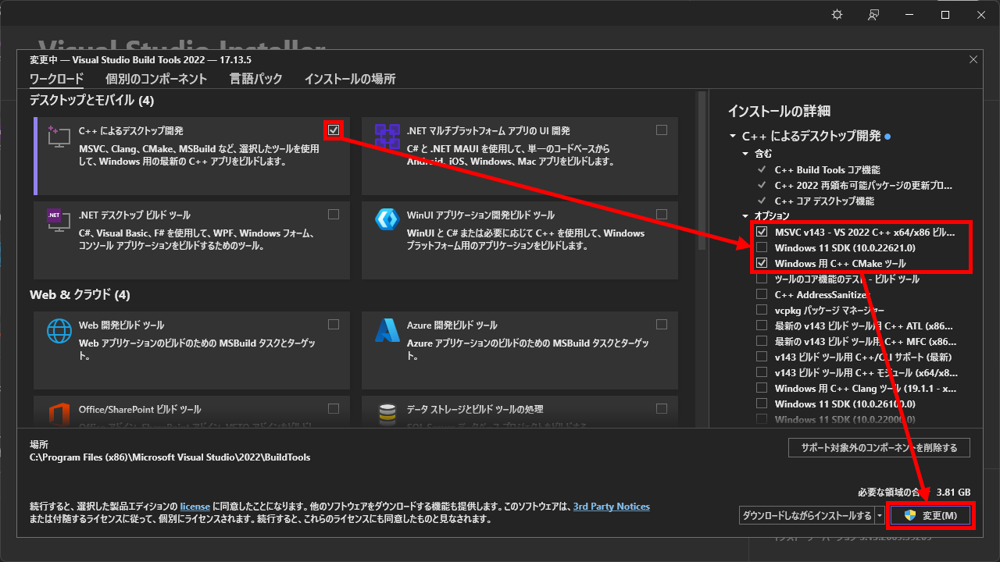
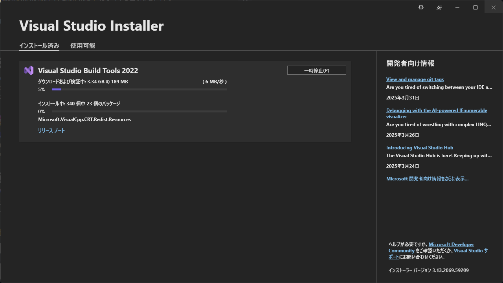
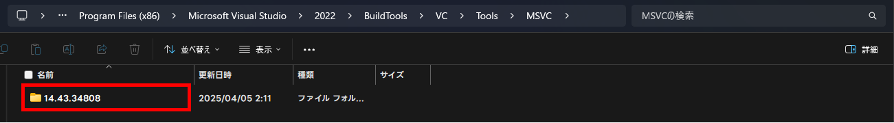
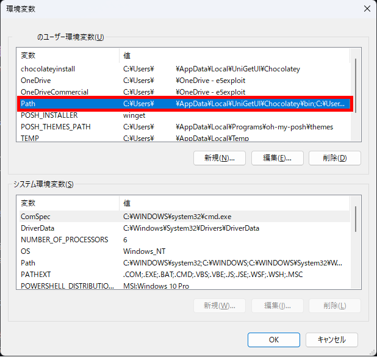

import { Aside, Steps, Tabs, TabItem, LinkCard } from '@astrojs/starlight/components'
import SyscatComment from "@/components/SyscatComment.astro"
export const CLI_OR_GUI_SYNC_KEY = 'c-lang/beginner::cli-or-gui';
export const COMPILER_SYNC_KEY = 'c-lang/beginner::compiler';

## 私はどの環境で開発すれば？

過去の講義資料を基にしたゆる～い案内です。 確実に授業に即しているかは分からないけど、自分の PC などで試すときは参考にしてください。

- EE （電気学科/電気工学専攻）  
   <LinkCard
      title="“VSBT 経由の MSVC” の節へ"
      href="#vsbt-経由の-msvcclexe"
   />

- EV （電気学科/電子情報工学専攻）  
   <LinkCard
      title="“w64devkit 経由の MinGW” の節へ"
      href="#w64devkit-経由の-mingw"
   />
- KK （情報科学科/コンピュータシステム専攻）  
   <LinkCard
   title="“構築: エディター環境 - XCode” の節へ"
   href="#xcode"
   />
- KX （情報科学科/メディア情報専攻）  
   <LinkCard
   title="“構築: エディター環境 - XCode” の節へ"
   href="#xcode"
   />


## 構築: コンパイラー環境

### Windows 

<Aside type="tip" title="用語">

- VSBT（Visual Studio Build Tools）  
   Visual C++ のコンパイラーを含む、プログラムのコンパイルをコマンドラインから行なうツールセット
- Visual Studio Installer  
   VSBT を構成する各種コンポーネントの インストール/アンインストール を行うツール
- PowerShell  
   Windows に標準でインストールされているコマンドラインツール

</Aside>

#### VSBT 経由の MSVC（`cl.exe`）

<Steps>

1. Visual Studio Installer をインストールする  

   <Tabs syncKey={CLI_OR_GUI_SYNC_KEY}>
      <TabItem label="CLI">

      <kbd>Win</kbd> → `powershell` → <kbd>Enter</kbd> で PowerShell を起動します（ショートカット: <kbd>Win</kbd> + <kbd>X</kbd> → <kbd>I</kbd>）。  
      その後、次のコマンドを実行して Visual Studio Installer をインストールします [^vsbt-winget]:

      ```powershell
      winget install Microsoft.VisualStudio.2022.BuildTools
      ```

      インストールの完了後、自動的に Visual Studio Installer が起動します。
      もし起動しない場合は、スタートメニューから “Visual Studio Installer” を検索して起動してください。

      </TabItem>
      <TabItem label="GUI">
      [Build Tools for Visual Studio 2022 - Microsoft](https://visualstudio.microsoft.com/ja/downloads/#build-tools-for-visual-studio-2022) にアクセスし、“ダウンロード” ボタンをクリックします。  
      その後、ダウンロードされた `vs_BuildTools.exe` をクリックし、Visual Studio Installer を起動します。
      </TabItem>
   </Tabs>

2. VSBT をインストールする  

   “C++ によるデスクトップ開発” にチェックを入れ、
   - “MSVC v143 - VS 2022 C++ x64/x86 ビルド ツール（最新）”  
      （バージョンは変動する可能性アリ）
   - “Windows 用 C++ CMake ツール”  

   の 2 つにチェックを入れます。その後、“変更” をクリックします。

   

   インストールが完了するまで待機します。
   

   <SyscatComment type="SLEEPING">PC やネットワークの速度によっては時間を要するから、お茶でも飲んでゆっくり待ってね。</SyscatComment>

3. MSVC のバージョンを特定する

   <Tabs syncKey={CLI_OR_GUI_SYNC_KEY}>
      <TabItem label="CLI">

      PowerShell で次のコマンドを実行し、どのバージョンがインストールされているかを確認します:

      ```powershell
      ls -name "C:\Program Files (x86)\Microsoft Visual Studio\2022\BuildTools\VC\Tools\MSVC"
      ```

      すると、次のような出力が得られます（例）:

      ```powershell
      14.43.34808
      ```

      これが、MSVC のバージョン番号の一例です。 これをメモしておきます。

      <Aside>
         Visual Studio Installer でインストールする際、“インストールの場所” を変更した際は、`ls` の引数のパスを変更する必要があります。
      </Aside>

      </TabItem>
      <TabItem label="GUI">

      エクスプローラーで、MSVC が含まれるフォルダー
      ```text
      C:\Program Files (x86)\Microsoft Visual Studio\2022\BuildTools\VC\Tools\MSVC
      ```
      に移動します。 (ショートカット: パスをコピー後、<kbd>Win</kbd> + <kbd>R</kbd> → <kbd>Ctrl</kbd> + <kbd>V</kbd> → <kbd>Enter</kbd>)
      
      

      作業フォルダー内にあるフォルダーの名前が MSVC のバージョン番号の一例です。 これをメモしておきます。

      <Aside>
         Visual Studio Installer でインストールする際、“インストールの場所” を変更した際は、“ファイル名を指定して実行” のパスを変更する必要があります。
      </Aside>

      </TabItem>
   </Tabs>


4. 環境変数を設定する  

   MSVC のバージョンが特定できたら、次に示すパス中の緑の箇所を特定したバージョンに置き換え、クリップボードやメモ帳などにコピーしておきます [^vsbt-path]:
   ```text ins="{MSVC ver.}"
   C:\Program Files (x86)\Microsoft Visual Studio\2022\BuildTools\VC\Tools\MSVC\{MSVC ver.}\bin\Hostx64\x64
   ```

   e.g. `14.43.34808`:
   ```text ins="14.43.34808"
   C:\Program Files (x86)\Microsoft Visual Studio\2022\BuildTools\VC\Tools\MSVC\14.43.34808\bin\Hostx64\x64
   ```

   パスの準備ができたら、 <kbd>Win</kbd> → `env` で “環境変数を編集” を起動します。  
   その後、ユーザー環境変数セクションの `Path` (下図の赤枠) をダブルクリックします。
   

[^1]: [Mac の大文字と小文字を区別するファイルシステムとの非互換性 - Steam サポート ↗](https://help.steampowered.com/ja/faqs/view/0395-A862-13F3-6E82#:~:text=%E3%80%8CJournaled%20HFS%E3%80%8D%E3%80%81%E3%80%8CAPFS,%E3%81%93%E3%81%A8%E3%82%92%E7%A4%BA%E3%81%97%E3%81%A6%E3%81%84%E3%81%BE%E3%81%99%E3%80%82)

