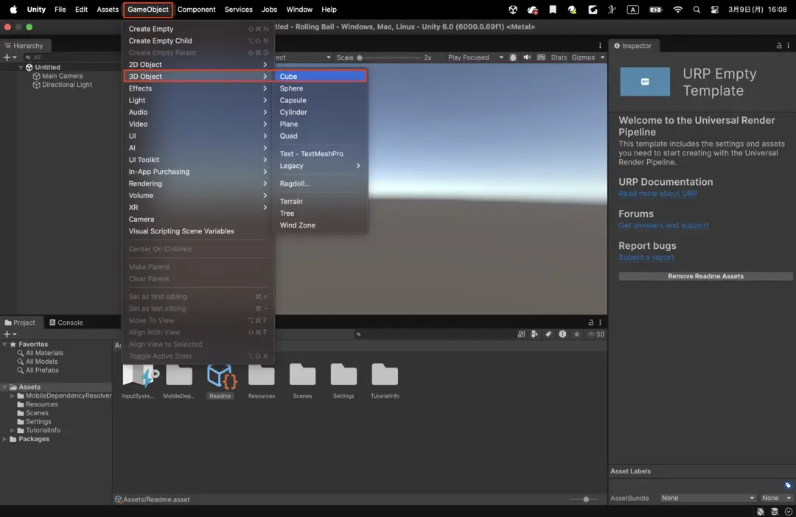
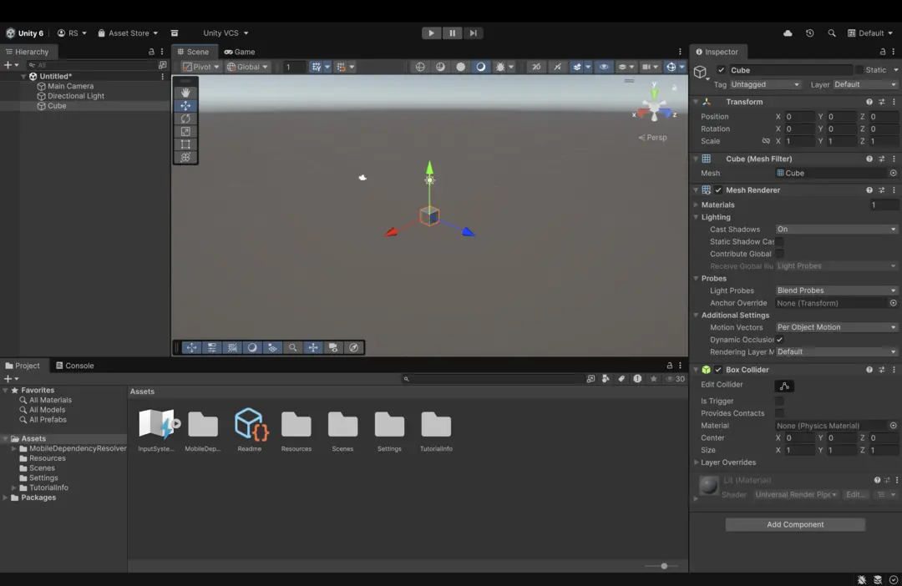
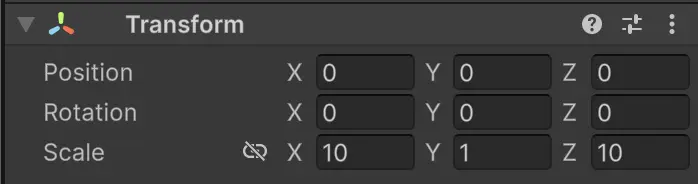
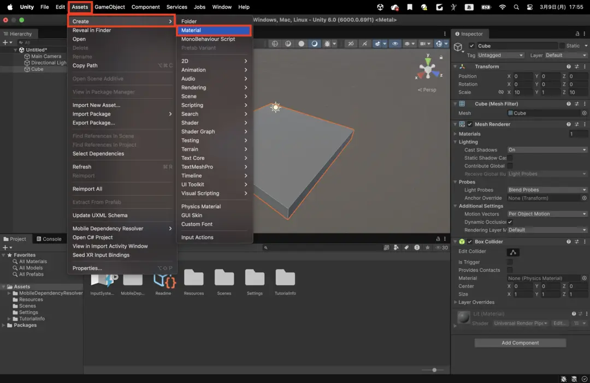
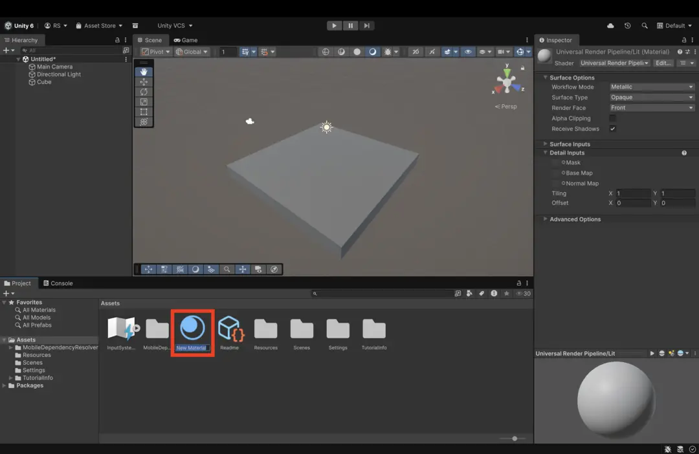
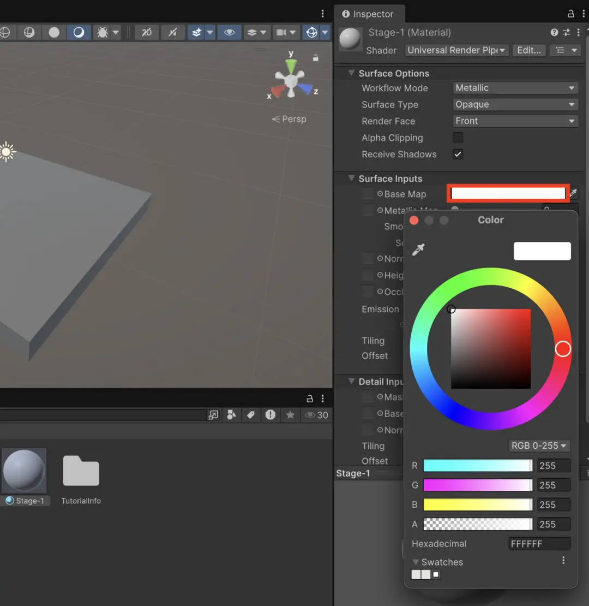
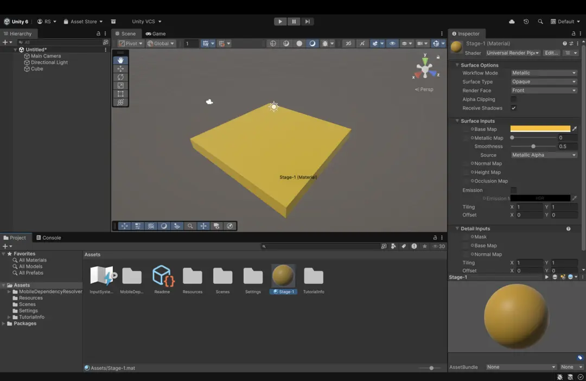

import { Aside, Steps, Tabs, TabItem, LinkCard } from '@astrojs/starlight/components'
import SyscatComment from "@/components/SyscatComment.astro"

それでは早速ステージを作っていきましょう！

<Steps>

1. #### 「GameObject」を作ってみよう

   

   メニューバーから **GameObject ＞ 3D Object ＞ Cube** を選択して四角の箱を作ります。

   

   選択できたらこのように Scene View の真ん中に箱と矢印が表示されるはずです。また、Hierarchy Window にも「Cube」が追加されていますね。この箱を今からステージにしていきます。

2. #### 「Cube」の場所やサイズを変えてみよう

   Cube の **Inspector** 欄にある **Transform** の各項目（Position, Rotation, Scale）に、直接数字を打ち込んで大きさを変えてみましょう！

   

   **3つの基本設定項目**
   - **Position（位置）**: オブジェクトが世界のどこに居るかを示す「座標」です。
   - **Rotation（回転）**: オブジェクトがどの方向を向いているかを示す「角度」です。
   - **Scale（尺度）**: オブジェクトの「大きさ」です。

   **3Dの方向を決める「XYZ軸」**
   Unityの3D空間は、以下の3つの軸で構成されています。

   | 軸 | Scene Viewの色 | 役割（Positionの場合） |
   | :--- | :--- | :--- |
   | **X軸** | **赤** | **横**（左右）の動き |
   | **Y軸** | **緑** | **縦**（上下）の動き |
   | **Z軸** | **青** | **奥行き**（前後）の動き |

   <Aside type="caution" title="便利なショートカット">
   エディタ左上のアイコン（またはキーボードの **W / E / R**）を切り替えることで、Scene画面上の矢印を直接マウスでドラッグして操作することも可能です。

   - **Wキー**: 移動（Position）
   - **Eキー**: 回転（Rotation）
   - **Rキー**: 拡縮（Scale）
   </Aside>

   それでは、値を下の画像のように設定してください。
   

3. #### 「Cube」に色をつけてみよう

   オブジェクトを好きな色に変えてみましょう！

   

   メニューバーから **Assets ＞ Create ＞ Material** を選択してマテリアルを制作します。

   

   制作できたら Project Window に「New Material」ができていると思います。これをオブジェクトにつけることで色や材質を変えられます。

   <Aside type="caution" title="名前の付け方">
   マテリアルが増えると見分けがつかなくなるので、名前部分をクリックして「Stage-1」など分かりやすい名前に変えてあげましょう。
   </Aside>

   

   **色の設定手順**
   1. Inspector Window の **Base Map**（または Albedo）の横にある白い四角をクリックします。
   2. カラーパレットが出るので、好きな色に設定します。
   3. Project Window から作成したマテリアルを、Scene 上の **Cube にドラッグ&ドロップ** します。

   

   色が変わりましたね！オブジェクトが好きな色になるだけで愛着が湧きますね。

</Steps>
