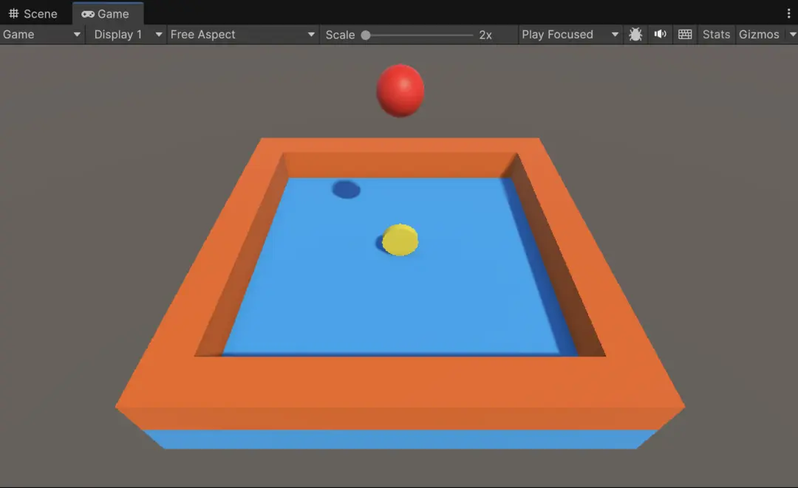
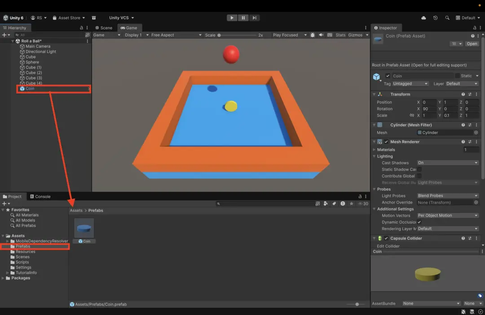
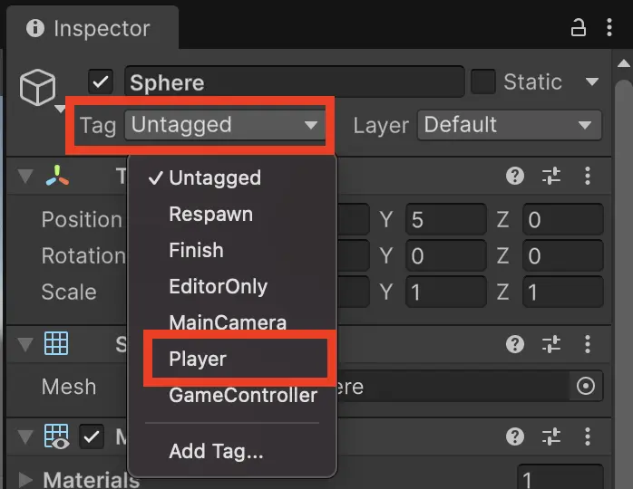
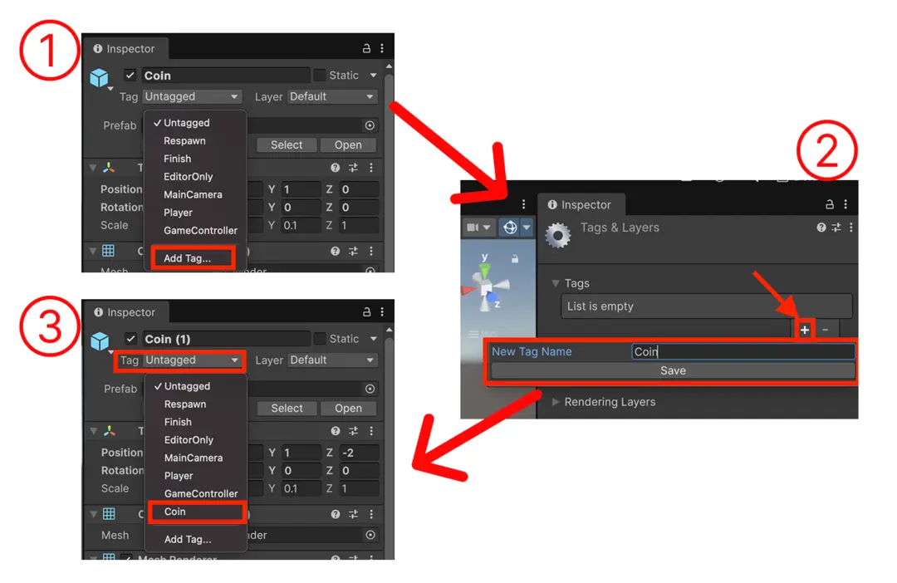
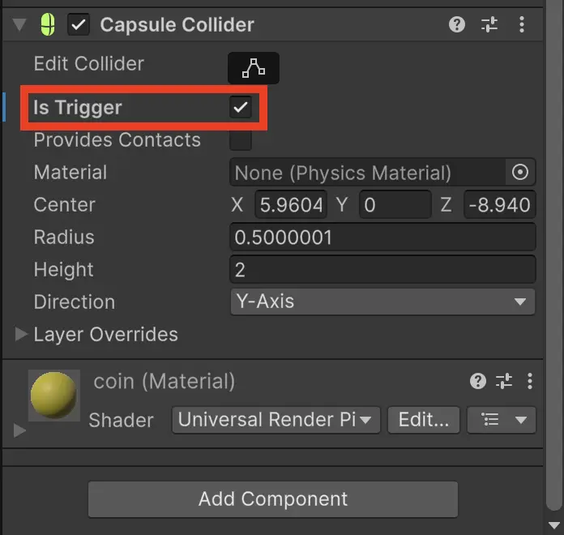

import { Aside, Steps, Tabs, TabItem, LinkCard } from '@astrojs/starlight/components'
import SyscatComment from "@/components/SyscatComment.astro"
import V_play2 from "./_videos/play-2.avif"

現在のカメラの位置だとステージが見づらいので、全体を俯瞰（ふかん）できるように調整しましょう。

 #### **カメラの位置調整**
Hierarchyで「 **Main Camera** 」を選択し、Game Viewを見ながらステージ全体がよく見える位置に編集します。

Hierarchyで「Main Camera」を選択して、Game Viewを見ながらステージ全体がよく見える位置にTransformを編集してカメラを動かしてみましょう。
一例ですが、以下のように設定するとよいでしょう。
| Position (X, Y, Z) | Rotation (X, Y, Z) | Scale (X, Y, Z) |
| --- | --- | --- |
| ( 0, 8, -8 )   | ( 45, 0, 0 )  | 変更なし |

---

### 1. 収集アイテム（Coin）の作成
次に、ゲームの目的となるコインを作っていきます。

1. **Cylinder（円柱）の作成**
   メニューバーから **GameObject ＞ 3D Object ＞ Cylinder** を選択します。
   <Aside type="tip">
   作成できたら、Inspectorの一番上の名前を「Cylinder」から『**Coin**』に書き換えましょう！
   </Aside>

2. **形を整える**
   コインらしい見た目にするために、Transformの値を以下のように設定します。

   | 設定項目 | Position (X, Y, Z) | Rotation (X, Y, Z) | Scale (X, Y, Z) |
   | :--- | :--- | :--- | :--- |
   | **数値** | ( 0, 1, 0 ) | ( 90, 0, 0 ) | ( 1, 0.1, 1 ) |

   

   <Aside>
   **マテリアルの設定**
   マテリアルの色をコインらしく（黄色や金色など）変えましょう。
   ※背景の床の色と被る場合は、床の色も調整して見やすくするのがコツです。
   </Aside>

---

### 2. 収集アイテムのプレハブ（Prefab）化

1つ作ったコインを「設計図」として保存し、いつでも使い回せるようにします。

#### **Prefab（プレハブ）とは？**
- **再利用ができる:** 一度作れば、何個でも同じコインを配置できます。
- **一括修正ができる:** 設計図の色を変えるだけで、全てのコインに反映されます。

<Steps>

1. Prefabsフォルダを作ろう
   Project Window の **Assets** フォルダ内で **右クリック ＞ Create ＞ Folder** を作成し、名前を「**Prefabs**」にします。

2. ドラッグ＆ドロップで登録
   Hierarchy にある「**Coin**」を、作成した **Prefabs フォルダの中へドラッグ＆ドロップ** します。

   

3. 確認
   Hierarchy の「Coin」の文字が **青色** に変わっていれば成功です！

</Steps>

#### **コインの配置**
「Prefabs」の中にある『Coin』を、ステージ上にいくつかドラッグ＆ドロップして配置してみましょう。

<Aside type="tip" title="コースデザインのヒント">
そのまま置くと床に埋まってしまうので、**CoinのPositionのYを 1 に変更**してください。
コインを並べて、プレイヤーをゴールへ導く「導線」を作ってみましょう！
</Aside>

---

### 3. タグ（Tag）をつけてみよう

「玉がコインに触れたとき」を判別するために、オブジェクトに「名札（タグ）」をつけます。

- **Playerタグ**: 玉（プレイヤー）専用の名札。
- **Coinタグ**: 収集アイテム専用の名札。

#### **手順1：プレイヤーにタグをつける**
1. Hierarchy で **Sphere（プレイヤー）** を選択。
2. Inspector の一番上にある **Tag** をクリック。
3. リストから「**Player**」を選択。



#### **手順2：コイン用のタグを新規作成**
1. Hierarchy で **Coin** を選択。
2. Inspector の **Tag ＞ Add Tag...** を選択。
3. **＋** ボタンを押し、「**Coin**」と入力して **Save**。



#### **手順3：コインにタグを適用する**
**※作成しただけでは適用されません！**
1. 再度 Hierarchy で **Coin** を選択。
2. Inspector の **Tag** から、今作った「**Coin**」を選択。

<Aside type="caution" title="スペルミスに注意！">
プログラムで使うので、`Coin` と `coin` を間違えないように正確に入力しましょう！
</Aside>

### 4. コインを獲得する処理を作ろう

タグの設定ができたら、次はプログラムを更新して「コインに触れたら消える」仕組みを実装します。

#### **手順1：コインを通り抜けられるようにする**
今のままだとコインは「壁」と同じ扱いなので、玉がぶつかって止まってしまいます。これを「アイテム」として扱えるように設定を変えます。

1.  **Project Window** の **Prefabs** フォルダ内にある **Coin** プレハブを選択します。
2.  **Inspector Window** の **Collider**（例：**Capsule Collider** や **Box Collider**）コンポーネントを探します。
3.  その **Collider** コンポーネントの **Is Trigger** にチェックを入れます。



<Aside type="tip" title="Is Triggerとは？">
チェックを入れると物理的にぶつからなくなり、代わりに「重なった（通り抜けた）こと」をプログラムで検知できるようになります。
</Aside>

#### **手順2：PlayerController スクリプトを更新する**
**Scripts** フォルダ内の **PlayerController** を開き、中身を以下のコードに書き換えます。

```cs
using UnityEngine;
using UnityEngine.InputSystem;

public class PlayerController : MonoBehaviour
{
    public float speed = 3f;
    private Rigidbody rb;

    // --- 追加：獲得したコインの数を数える変数 ---
    private int score = 0; 

    void Start()
    {
        rb = GetComponent<Rigidbody>();
    }

    void Update()
    {
        // 移動の処理
        Vector2 moveInput = Vector2.zero;
        if (Keyboard.current != null)
        {
            float x = 0; float y = 0;
            if (Keyboard.current.wKey.isPressed || Keyboard.current.upArrowKey.isPressed) y = 1;
            if (Keyboard.current.sKey.isPressed || Keyboard.current.downArrowKey.isPressed) y = -1;
            if (Keyboard.current.aKey.isPressed || Keyboard.current.leftArrowKey.isPressed) x = -1;
            if (Keyboard.current.dKey.isPressed || Keyboard.current.rightArrowKey.isPressed) x = 1;
            moveInput = new Vector2(x, y);
        }
        Vector3 movement = new Vector3(moveInput.x, 0, moveInput.y);
        rb.AddForce(movement * speed);
    }

    // --- 追加：当たり判定の処理 ---
    private void OnTriggerEnter(Collider other)
    {
        // もし当たったオブジェクトのタグが "Coin" だったら
        if (other.gameObject.CompareTag("Coin"))
        {
            // 当たったコインを消去する
            Destroy(other.gameObject);

            // スコアを1増やす
            score = score + 1;
            Debug.Log("現在のスコア: " + score);
        }
    }
}
```

<Aside type="tip" title="コードの解説">

- private int score;
  - スコアを保存するための箱（変数）です。

- other.gameObject.CompareTag("Coin")
  - ぶつかった相手のタグが Coin かどうかを確認しています。

- Destroy(other.gameObject);
  - 当たったオブジェクト（コイン）をシーンから消去します。
</Aside>

これで、玉を転がしてコインに触れると、コインが消えてコンソールにスコアが表示されるようになります！


