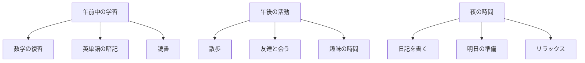

import { Aside, LinkCard } from "@astrojs/starlight/components";
import SyscatComment from "@/components/SyscatComment.astro"
import Sandpack from "@/components/Sandpack.astro";
import Checkpoint from '@/components/Checkpoint.astro';
import { Code } from '@astrojs/starlight/components';

## HTMLの階層構造って何？

HTMLは、要素を入れ子にして階層構造を作ります。これは家族の関係に似ています[^html-elements]。

- **親要素**: 他の要素を包んでいる要素
- **子要素**: 親要素の中にある要素
- **兄弟要素**: 同じ親を持つ要素同士

<Sandpack>

```html index.html
<!DOCTYPE html>
<html lang="ja">
<head>
  <meta charset="UTF-8">
  <title>階層構造の例</title>
</head>
<body>
  <!-- bodyが親、headerとmainとfooterが子、headerとmainとfooterは兄弟 -->
  <header>
  <h1>ももちゃんの読書日記</h1>
  <!-- headerが親、h1が子 -->
  </header>
  
  <main>
  <!-- mainが親、pが子 -->
  <p>今日は図書館で素敵な本を見つけました。</p>
  </main>
  
  <footer>
  <p>📚 読書記録 2025年</p>
  </footer>
</body>
</html>
```

</Sandpack>

<SyscatComment>

HTMLの階層は、まるでマトリョーシカ！外側から内側へ（左から右へ）、どんどん小さくなっていくよ。

</SyscatComment>

## なぜ階層構造が重要？

階層構造を正しく理解すると: 

- **整理された文書**: 内容が論理的に整理される
- **読みやすいコード**: 他の人が理解しやすい
- **CSSが書きやすい**: スタイルを効率的に適用できる
- **保守性向上**: 後で修正がしやすい

## 親子関係と兄弟関係を見てみよう

実際の例で親子関係と兄弟関係を確認してみましょう: 

<Sandpack>

```html index.html
<!DOCTYPE html>
<html lang="ja">
<head>
  <meta charset="UTF-8">
  <title>家族関係で理解する階層</title>
</head>
<body>
  <!-- 祖父母: body -->
  <article>
  <!-- 親: article -->
  <h2>今日の料理日記</h2>
  <!-- 子: h2（第一子） -->
  
  <p>今日は初めてカレーライスを作りました。</p>
  <!-- 子: p（第二子） -->
  
  <p>スパイスの香りが台所いっぱいに広がって、とても良い気分でした。</p>
  <!-- 子: p（第三子） -->
  
  <!-- h2、p、pは兄弟関係 -->
  </article>
  
  <article>
  <!-- 親: article（上のarticleと兄弟） -->
  <h2>明日の予定</h2>
  <p>明日はパンケーキに挑戦したいと思います。</p>
  </article>
</body>
</html>
```

</Sandpack>

### 実践: 階層構造を意識して書いてみよう

以下のコメントを参考に、HTMLの階層構造を作ってみてください: 

<Sandpack>

```html index.html
<!DOCTYPE html>
<html lang="ja">
<head>
  <meta charset="UTF-8">
  <title>階層構造の練習</title>
</head>
<body>
  <!-- TODO: main要素の中に2つのsection要素を作成してください -->
  <!-- 1つ目のsection: -->
  <!--   - h2要素: "好きな本のジャンル" -->
  <!--   - p要素: "私は冒険小説が大好きです。" -->
  <!--   - p要素: "特にファンタジー要素があるものに惹かれます。" -->
  
  <!-- 2つ目のsection: -->
  <!--   - h2要素: "最近読んだ本" -->
  <!--   - p要素: "『魔法の図書館』という本を読みました。" -->
  
</body>
</html>

```

</Sandpack>

<details>
<summary>解答例を見る</summary>

```html
<main>
  <section>
  <h2>好きな本のジャンル</h2>
  <p>私は冒険小説が大好きです。</p>
  <p>特にファンタジー要素があるものに惹かれます。</p>
  </section>
  
  <section>
  <h2>最近読んだ本</h2>
  <p>『魔法の図書館』という本を読みました。</p>
  </section>
</main>
```

**階層関係:**
```
main (親)
├── section (子、mainの)
│   ├── h2 (子、sectionの)
│   ├── p (子、sectionの)
│   └── p (子、sectionの)
└── section (子、mainの)
  ├── h2 (子、sectionの)
  └── p (子、sectionの)
```

</details>

## divとspanの使い分け

HTMLには「意味のないタグ」も存在します。これらはグループ化やスタイリングのために使います[^html-elements]。

### div要素（ブロック要素）

`<div>` は、複数の要素をグループ化するためのコンテナです。

<Sandpack>

```html index.html
<!DOCTYPE html>
<html lang="ja">
<head>
  <meta charset="UTF-8">
  <title>div要素の使い方</title>
</head>
<body>
  <div>
  <!-- この div は日記エントリーをグループ化 -->
  <h2>散歩日記</h2>
  <p>今日は公園を30分歩きました。</p>
  <p>桜の花びらが風に舞っていて、とても美しかったです。</p>
  </div>
  
  <div>
  <!-- 別の日記エントリー -->
  <h2>読書の時間</h2>
  <p>午後は新しい小説を読み始めました。</p>
  <p>主人公の冒険にワクワクしています。</p>
  </div>
</body>
</html>
```

</Sandpack>

### 実践: divでグループ化してみよう

以下のコメントを参考に、関連する内容をdivでグループ化してみてください: 

<Sandpack>

```html index.html
<!DOCTYPE html>
<html lang="ja">
<head>
  <meta charset="UTF-8">
  <title>divでグループ化</title>
</head>
<body>
  <!-- TODO: 朝の時間をグループ化するdiv要素を作成 -->
  <!-- その中に以下を含めてください:  -->
  <!--   - h2要素: "朝の時間" -->
  <!--   - p要素: "朝食にトーストとコーヒーを飲みました。" -->
  <!--   - p要素: "新聞を読みながらゆっくり過ごしました。" -->
  
  <!-- TODO: 夜の時間をグループ化するdiv要素を作成 -->
  <!-- その中に以下を含めてください:  -->
  <!--   - h2要素: "夜の時間" -->
  <!--   - p要素: "夕食後は読書をしました。" -->
  <!--   - p要素: "お気に入りの音楽を聴きながらリラックスしました。" -->
  
</body>
</html>

```

</Sandpack>

<details>
<summary>解答例を見る</summary>

```html
<div>
  <h2>朝の時間</h2>
  <p>朝食にトーストとコーヒーを飲みました。</p>
  <p>新聞を読みながらゆっくり過ごしました。</p>
</div>

<div>
  <h2>夜の時間</h2>
  <p>夕食後は読書をしました。</p>
  <p>お気に入りの音楽を聴きながらリラックスしました。</p>
</div>
```

**div要素の役割:**
- 関連するコンテンツをグループ化
- CSSでまとめてスタイルを適用する際に便利
- セマンティック要素で表現できない場合の汎用コンテナ

</details>

### span要素（インライン要素）

`<span>` は、文章の一部分をグループ化するために使います。

<Sandpack>

```html index.html
<!DOCTYPE html>
<html lang="ja">
<head>
  <meta charset="UTF-8">
  <title>span要素の使い方</title>
</head>
<body>
  <h1>今日の天気日記</h1>
  
  <p>今日の天気は<span>晴れ</span>でした。気温は<span>25度</span>で、とても過ごしやすい一日でした。</p>
  
  <p>午後からは<span>少し雲が出て</span>きましたが、散歩には最適な天気でした。</p>
</body>
</html>
```

</Sandpack>

### 実践: spanで文章の一部を強調してみよう

以下のコメントを参考に、span要素を使って文章の特定の部分をマークしてみてください: 

<Sandpack>

```html index.html
<!DOCTYPE html>
<html lang="ja">
<head>
  <meta charset="UTF-8">
  <title>spanで部分的にマーク</title>
</head>
<body>
  <h1>カフェ巡り日記</h1>
  
  <!-- TODO: 以下の文章でspan要素を使って特定の部分をマークしてください -->
  <!-- "駅前の新しいカフェ" と "400円" をspan要素で囲んでください -->
  <p>今日は駅前の新しいカフェに行きました。コーヒーの値段は400円で、とても美味しかったです。</p>
  
  <!-- TODO: 以下の文章でspan要素を使って特定の部分をマークしてください -->
  <!-- "木のぬくもり" と "2時間" をspan要素で囲んでください -->
  <p>店内は木のぬくもりを感じる内装で、2時間ほどゆっくり過ごしました。</p>
</body>
</html>

```

</Sandpack>

<details>
<summary>解答例を見る</summary>

```html
<p>今日は<span>駅前の新しいカフェ</span>に行きました。コーヒーの値段は<span>400円</span>で、とても美味しかったです。</p>

<p>店内は<span>木のぬくもり</span>を感じる内装で、<span>2時間</span>ほどゆっくり過ごしました。</p>
```

**span要素のポイント:**
- 文章の途中で改行されない（インライン要素）
- 見た目は変わらないが、後でCSSでスタイルを適用できる
- 文章の意味的な区切りというより、装飾のための区切り

</details>

**ヒント:** span要素で囲んだ部分は、後からCSSで色を変えたり、フォントを変更したりできます。重要な情報や数値などをマークするのに使いましょう。

## セマンティック要素 vs div/span

適切なタグの選び方: 

> **選択の基準**: 
> - 意味がある場合 → セマンティック要素（header、main、article など）
> - 意味がない場合 → div または span
> - ブロック要素が必要 → div
> - インライン要素が必要 → span

<Sandpack>

```html index.html
<!DOCTYPE html>
<html lang="ja">
<head>
  <meta charset="UTF-8">
  <title>適切なタグ選択の例</title>
</head>
<body>
  <!-- セマンティック: ページのヘッダーなので header -->
  <header>
  <h1>園芸日記</h1>
  </header>
  
  <!-- セマンティック: メインコンテンツなので main -->
  <main>
  <!-- セマンティック: 独立した記事なので article -->
  <article>
    <h2>トマトの成長記録</h2>
    <p>種を植えてから<span>2週間</span>が経ちました。</p>
  </article>
  
  <!-- div: 装飾用のグループ化 -->
  <div>
    <p>※成長の様子は毎週更新予定です</p>
  </div>
  </main>
</body>
</html>
```

</Sandpack>

## リスト要素で情報を整理する

情報をリスト形式で整理すると、読みやすく分かりやすくなります[^html-elements]。

### 順序なしリスト（ul）

関連する項目を順序なく並べる場合に使います: 

<Sandpack>

```html index.html
<!DOCTYPE html>
<html lang="ja">
<head>
  <meta charset="UTF-8">
  <title>順序なしリストの例</title>
</head>
<body>
  <h1>買い物リスト</h1>
  
  <h2>今日買うもの</h2>
  <ul>
  <li>牛乳</li>
  <li>パン</li>
  <li>卵</li>
  <li>りんご</li>
  </ul>
  
  <h2>好きな果物</h2>
  <ul>
  <li>いちご</li>
  <li>みかん</li>
  <li>ぶどう</li>
  </ul>
</body>
</html>
```

</Sandpack>

### 実践: 順序なしリストを作ってみよう

以下のコメントを参考に、あなたの好きなものや持ち物をリストにしてみてください: 

<Sandpack>

```html index.html
<!DOCTYPE html>
<html lang="ja">
<head>
  <meta charset="UTF-8">
  <title>私のお気に入りリスト</title>
</head>
<body>
  <h1>私のお気に入り</h1>
  
  <!-- TODO: h2要素で "好きな本のジャンル" という見出しを作成 -->
  <!-- TODO: ul要素の中に3つのli要素を作成してください -->
  <!--  - "ミステリー小説" -->
  <!--  - "ファンタジー" -->
  <!--  - "エッセイ" -->
  
  <!-- TODO: h2要素で "趣味" という見出しを作成 -->
  <!-- TODO: ul要素の中に3つのli要素を作成してください -->
  <!--  - "読書" -->
  <!--  - "散歩" -->
  <!--  - "音楽鑑賞" -->
  
</body>
</html>

```

</Sandpack>

<details>
<summary>解答例を見る</summary>

```html
<h2>好きな本のジャンル</h2>
<ul>
  <li>ミステリー小説</li>
  <li>ファンタジー</li>
  <li>エッセイ</li>
</ul>

<h2>趣味</h2>
<ul>
  <li>読書</li>
  <li>散歩</li>
  <li>音楽鑑賞</li>
</ul>
```

**順序なしリスト（ul）の特徴:**
- 項目の順序に特別な意味がない
- 通常は黒い点（•）で表示される
- `<ul>` の直接の子要素は `<li>` のみ

</details>

### 順序ありリスト（ol）

手順や順序が重要な項目を並べる場合に使います: 

<Sandpack>

```html index.html
<!DOCTYPE html>
<html lang="ja">
<head>
  <meta charset="UTF-8">
  <title>順序ありリストの例</title>
</head>
<body>
  <h1>料理日記</h1>
  
  <h2>簡単パンケーキの作り方</h2>
  <ol>
  <li>小麦粉と砂糖をボウルに入れて混ぜる</li>
  <li>牛乳と卵を加えてよく混ぜる</li>
  <li>フライパンに生地を流し入れる</li>
  <li>両面を焼いて完成</li>
  </ol>
  
  <h2>今日やったこと</h2>
  <ol>
  <li>朝食を食べる</li>
  <li>掃除をする</li>
  <li>買い物に行く</li>
  <li>料理を作る</li>
  </ol>
</body>
</html>
```

</Sandpack>

### 実践: 順序ありリストを作ってみよう

以下のコメントを参考に、手順や順序が大切な内容をリストにしてみてください: 

<Sandpack>

```html index.html
<!DOCTYPE html>
<html lang="ja">
<head>
  <meta charset="UTF-8">
  <title>私の一日の流れ</title>
</head>
<body>
  <h1>理想的な一日のスケジュール</h1>
  
  <!-- TODO: h2要素で "朝のルーティン" という見出しを作成 -->
  <!-- TODO: ol要素の中に4つのli要素を順番に作成してください -->
  <!--  1. "起床" -->
  <!--  2. "歯磨き・洗顔" -->
  <!--  3. "朝食" -->
  <!--  4. "準備" -->
  
  <!-- TODO: h2要素で "勉強の手順" という見出しを作成 -->
  <!-- TODO: ol要素の中に5つのli要素を順番に作成してください -->
  <!--  1. "机を片付ける" -->
  <!--  2. "必要な教材を準備する" -->
  <!--  3. "計画を立てる" -->
  <!--  4. "実際に勉強する" -->
  <!--  5. "復習する" -->
  
</body>
</html>

```

</Sandpack>

<details>
<summary>解答例を見る</summary>

```html
<h2>朝のルーティン</h2>
<ol>
  <li>起床</li>
  <li>歯磨き・洗顔</li>
  <li>朝食</li>
  <li>準備</li>
</ol>

<h2>勉強の手順</h2>
<ol>
  <li>机を片付ける</li>
  <li>必要な教材を準備する</li>
  <li>計画を立てる</li>
  <li>実際に勉強する</li>
  <li>復習する</li>
</ol>
```

**順序ありリスト（ol）の特徴:**
- 項目の順序に意味がある（手順、ランキングなど）
- 自動的に番号が振られる（1, 2, 3...）
- `<ol>` の直接の子要素は `<li>` のみ

</details>

**ヒント:** 料理のレシピ、作業手順、時系列など、順番が重要な情報には `<ol>` を使いましょう。

### リストの入れ子構造

リストの中にさらにリストを作ることもできます: 

<Sandpack>

```html index.html
<!DOCTYPE html>
<html lang="ja">
<head>
  <meta charset="UTF-8">
  <title>入れ子リストの例</title>
</head>
<body>
  <h1>図書館での過ごし方</h1>
  
  <ul>
  <li>本を探す
    <ul>
    <li>カタログで検索</li>
    <li>書架を見て回る</li>
    <li>司書さんに相談</li>
    </ul>
  </li>
  <li>読書スペースを見つける
    <ul>
    <li>静かな個人席</li>
    <li>グループ学習室</li>
    <li>カフェスペース</li>
    </ul>
  </li>
  <li>本を読む</li>
  <li>本を返却する</li>
  </ul>
</body>
</html>
```

</Sandpack>

### 実践: 入れ子リストを作ってみよう

以下の図を参考に、階層のある情報を入れ子リストで整理してみてください: 



<SyscatComment type="CRYING">
なんか同じ図が 2 つ出ているんだけど、これはバグです。ごめんね。
</SyscatComment>

<Sandpack>

```html index.html
<!DOCTYPE html>
<html lang="ja">
<head>
  <meta charset="UTF-8">
  <title>私の学習計画</title>
</head>
<body>
  <h1>週末の学習計画</h1>
  
  <!-- TODO: ol要素で順序ありリストを作成してください -->
  <!-- 1つ目のli: "午前中の学習" -->
  <!--   その中にul要素を作成し、以下の3つのli要素を含める:  -->
  <!--   - "数学の復習" -->
  <!--   - "英単語の暗記" -->
  <!--   - "読書" -->
  
  <!-- 2つ目のli: "午後の活動" -->
  <!--   その中にul要素を作成し、以下の3つのli要素を含める:  -->
  <!--   - "散歩" -->
  <!--   - "友達と会う" -->
  <!--   - "趣味の時間" -->
  
  <!-- 3つ目のli: "夜の時間" -->
  <!--   その中にul要素を作成し、以下の3つのli要素を含める:  -->
  <!--   - "日記を書く" -->
  <!--   - "明日の準備" -->
  <!--   - "リラックス" -->
  
</body>
</html>

```

</Sandpack>

<details>
<summary>解答例を見る</summary>

```html
<ol>
  <li>午前中の学習
  <ul>
    <li>数学の復習</li>
    <li>英単語の暗記</li>
    <li>読書</li>
  </ul>
  </li>
  <li>午後の活動
  <ul>
    <li>散歩</li>
    <li>友達と会う</li>
    <li>趣味の時間</li>
  </ul>
  </li>
  <li>夜の時間
  <ul>
    <li>日記を書く</li>
    <li>明日の準備</li>
    <li>リラックス</li>
  </ul>
  </li>
</ol>
```

**入れ子リストのポイント:**
- 外側は順序ありリスト（`<ol>`）で時系列を表現
- 内側は順序なしリスト（`<ul>`）で関連項目をグループ化
- リストの中にリストを作ることで、情報の階層を表現できる

</details>

**ヒント:** 複雑な情報は図式化してから HTMLコードに落とし込むと分かりやすくなります。上の mermaid 図のような構造をHTMLで表現してみてください。

## セマンティック要素を組み合わせて文書構造を作る

これまで学んだ要素を全て組み合わせて、完成度の高い文書構造を作ってみましょう: 

<Sandpack options={{ editorHeight: 600 }}>

```html index.html
<!DOCTYPE html>
<html lang="ja">
<head>
  <meta charset="UTF-8">
  <meta name="description" content="趣味と日常を記録する個人ブログ">
  <title>たろうの生活記録</title>
</head>
<body>
  <header>
  <h1>たろうの日常ブログ</h1>
  <nav>
    <ul>
    <li><a href="#hobbies">趣味</a></li>
    <li><a href="#study">学習記録</a></li>
    <li><a href="#daily">日記</a></li>
    </ul>
  </nav>
  </header>
  
  <main>
  <section id="hobbies">
    <h2>私の趣味</h2>
    
    <article>
    <h3>読書について</h3>
    <p>毎月<span>5冊以上</span>の本を読むことを目標にしています。</p>
    
    <h4>好きなジャンル</h4>
    <ul>
      <li>推理小説</li>
      <li>歴史小説</li>
      <li>科学エッセイ</li>
    </ul>
    </article>
    
    <article>
    <h3>料理の記録</h3>
    <p>週末には新しいレシピに挑戦しています。</p>
    
    <div>
      <h4>今月作った料理</h4>
      <ol>
      <li>カレーライス</li>
      <li>オムライス</li>
      <li>パスタ</li>
      </ol>
    </div>
    </article>
  </section>
  
  <section id="study">
    <h2>学習の記録</h2>
    
    <article>
    <h3>今月の目標</h3>
    <ul>
      <li>プログラミング
      <ul>
        <li>HTML基礎</li>
        <li>CSS基礎</li>
      </ul>
      </li>
      <li>英語学習
      <ul>
        <li>単語100個暗記</li>
        <li>洋書1冊読破</li>
      </ul>
      </li>
    </ul>
    </article>
  </section>
  
  <aside>
    <h2>最近のお気に入り</h2>
    <div>
    <h3>音楽</h3>
    <p>クラシック音楽に最近ハマっています。</p>
    </div>
    
    <div>
    <h3>カフェ</h3>
    <p>駅前の<span>コーヒーハウス</span>がお気に入りです。</p>
    </div>
  </aside>
  </main>
  
  <footer>
  <p>📝 たろうの日常ブログ - 毎日を大切に記録中</p>
  <p>お問い合わせ: taro@example.com</p>
  </footer>
</body>
</html>
```

</Sandpack>

<Aside type="tip">
**階層の深さに注意** — 階層が深くなりすぎると読みにくくなります。適度な深さを心がけましょう。一般的には3-4階層程度が読みやすいとされています。
</Aside>

## 構造を整理するためのチェックリスト

よい文書構造を作るためのポイント: 

> **構造チェックリスト**: 
> - ✅ 親子関係が論理的に正しい
> - ✅ 兄弟要素は同じレベルの内容
> - ✅ セマンティック要素を優先的に使用
> - ✅ div/spanは意味がない場合のみ使用
> - ✅ リストは適切なタイプ（ul/ol）を選択
> - ✅ 階層が深くなりすぎない（3-4階層程度）

<LinkCard
  title="HTML要素の入れ子ルール"
  description="MDNで詳しく学ぶ"
  href="https://developer.mozilla.org/ja/docs/Web/HTML/Element"
/>

<Checkpoint>

- [ ] HTMLの親子関係と兄弟関係を理解した
- [ ] divとspanの適切な使い分けができる
- [ ] 順序なしリスト（ul）と順序ありリスト（ol）の使い分けを理解した
- [ ] リストの入れ子構造を作ることができる
- [ ] セマンティック要素を組み合わせて文書構造を作ることができる

</Checkpoint>

[^html-elements]: [HTMLの要素を表すタグ](https://sysken.esa.io/posts/1040) - esa#1040
